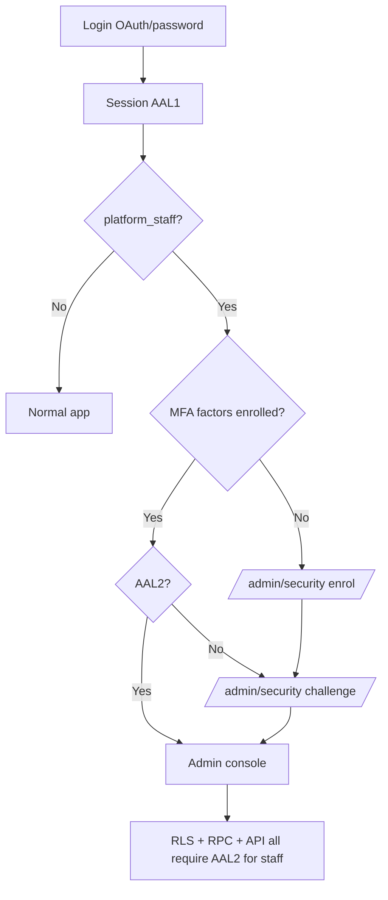

# Admin 2FA (TOTP) — implementation plan

Plan for adding TOTP two-factor authentication to the Quni admin dashboard (platform staff only). Uses Supabase Auth's built-in MFA. Does **not** touch student or landlord auth.

---

## Verdict

**Worth doing, with a phased rollout and a wider “admin boundary” than RLS alone.**

The three layers (enrolment UI → client gate → DB/API enforcement) are the correct shape. Supabase Auth TOTP is the right tool. Scope it to platform staff, not student/landlord auth. Reuse existing admin identification rather than inventing a parallel check.

---

## Goals

- Require TOTP (authenticator app) for all platform staff accessing the admin console.
- Leave student and landlord authentication unchanged.
- Reuse existing admin identification (`platform_staff` + `is_platform_admin()`).
- Defense in depth: UI gate + Postgres RLS + admin RPCs + Vercel APIs + edge functions.

---

## What already exists in the codebase

### Admin identity is DB-backed (required for RLS)

`public.is_platform_admin()` matches JWT email to `platform_staff`:

```sql
-- supabase/migrations/20260526120000_platform_staff.sql
create or replace function public.is_platform_admin()
returns boolean
language sql
stable
security definer
set search_path = public
as $$
  select exists (
    select 1
    from public.platform_staff ps
    where ps.email = lower(trim(coalesce(auth.jwt() ->> 'email', '')))
  );
$$;
```

The “stop if admin is client-only” check **passes** — a server-side admin predicate already exists.

### Admin checks are centralized

| Layer | Where |
|--------|--------|
| Client role | `fetchIsPlatformAdmin()` / `AuthContext` → `role === 'admin'` |
| Route guard | `ProtectedRoute` + `AdminLayout` |
| Vercel APIs | `requireAdminUser()` in `api/lib/adminAuth.js` |
| Edge functions | `isPlatformAdminUser()` in `supabase/functions/_shared/platformStaff.ts` |
| Postgres | `is_platform_admin()` in RLS policies and admin RPCs |

### Natural integration points

- **Enrolment UI:** `/admin/settings` exists (`AdminSettings.tsx`), or a dedicated `/admin/security` route.
- **Challenge gate:** `AdminLayout` wraps every `/admin/*` route — better than per-page checks.

---

## Three implementation pieces

### 1. Enrolment UI

Add a **Security** section in the admin area where platform staff can set up 2FA.

**Flow:**

1. On open, call `supabase.auth.mfa.enroll({ factorType: 'totp' })`.
2. Render the returned QR code as an `` for scanning (Google Authenticator, 1Password, etc.).
3. Show the secret string in plain text as a fallback.
4. Accept a 6-digit code; call `mfa.challenge()` + `mfa.verify()` to activate the factor.
5. Use `mfa.listFactors()` to show enrolled factors.
6. Use `mfa.unenroll()` to remove a factor (confirm first; call `refreshSession()` after so AAL downgrades immediately).
7. Support enrolling more than one factor — surface clearly as **“Add a backup authenticator.”**

**Recommendations:**

- Prefer a dedicated **`/admin/security`** route (exempt from challenge gate) over burying enrolment inside full Settings — Settings loads a lot of RLS-protected config that will fail at AAL1 once enforcement is on.
- Show enrolled factors with friendly labels (“Primary phone”, “Backup iPad”).
- After verify, call `refreshSession()` so the JWT picks up AAL2 immediately.
- Copy should say “Required for all platform staff” if enforcing.

### 2. Challenge gate on `/admin` routes

Wrap the admin section so that on entry it calls `mfa.getAuthenticatorAssuranceLevel()`.

**If the user is platform staff and `currentLevel` is `aal1` while `nextLevel` is `aal2`:** render a challenge screen (enter TOTP → `mfa.challenge()` + `mfa.verify()`) before showing admin content.

**The enrolment/challenge routes themselves must remain reachable at AAL1** so staff can set up and complete MFA.

**Implement in `AdminLayout`** (after role check), with route exceptions:

- `/admin/security` — enrolment + challenge
- Optionally a minimal locked shell with sidebar link to Security only

**Do not** put the gate in `ProtectedRoute` — that component is shared with non-admin routes.

#### Three MFA states (not just two)

| State | UX |
|--------|-----|
| No factors enrolled | “Set up 2FA” — cannot use admin data once enforcement is on |
| Factors enrolled, session AAL1 | TOTP challenge screen |
| Session AAL2 | Normal admin console |

The condition `currentLevel === aal1 && nextLevel === aal2` only covers **“MFA enrolled but not verified this session.”** Admins who have **never enrolled** stay at `aal1`/`aal1` and need the enrolment screen, not a challenge.

Consider re-checking AAL on focus/visibility if sessions can downgrade without navigation.

### 3. RLS + RPC + API hardening

Add restrictive enforcement so platform staff admin access requires **AAL2**.

**Postgres helper (preferred over editing ~100+ policies inline):**

```sql
create or replace function public.is_platform_admin_mfa()
returns boolean
language sql
stable
security definer
set search_path = public
as $$
  select public.is_platform_admin()
    and coalesce(auth.jwt() ->> 'aal', 'aal1') = 'aal2';
$$;
```

**Admin-only RLS policies** — replace `is_platform_admin()` with `is_platform_admin_mfa()`.

**Combined policies** (e.g. “owner OR admin”) — only tighten the admin branch:

```sql
(user_id = auth.uid()) OR (is_platform_admin() AND coalesce(auth.jwt() ->> 'aal', 'aal1') = 'aal2')
```

Do **not** blindly apply `(aal = 'aal2' OR NOT admin)` to every policy.

**Also update:**

- Admin **storage** policies (e.g. `student-documents` admin read)
- Admin **RPCs** (`SECURITY DEFINER` functions that guard with `is_platform_admin()` only, e.g. `admin_update_property_fee_snapshots`)
- **`requireAdminUser`** in `api/lib/adminAuth.js` — decode/check `aal` on the JWT
- **Edge functions** using `isPlatformAdminUser()` — same AAL2 rule

Students and landlords use separate RLS policies and are unaffected.

---

## Architecture



---

## Gaps to address (RLS alone is not enough)

### Vercel APIs bypass user RLS

Many admin paths use **service role** after `requireAdminUser`:

- `api/admin/living-console-snapshot.ts`
- Knowledge base, Stripe/Xero refunds, fee-exempt APIs, etc.

A stolen password-only session (AAL1) could still hit those APIs unless **`requireAdminUser` also requires AAL2**. Treat RLS as necessary, not sufficient.

### Admin pages use hybrid data access

- **Direct Supabase client** (bookings, payments, properties, Qase, …) — subject to RLS.
- **Vercel API + service role** (Living Console snapshot, payments admin actions, …) — needs JWT AAL2 check before service role use.

### Legacy `user_metadata.role === 'admin'`

Client and API still honor metadata admin; **RLS does not**. Before or alongside MFA, decide whether to retire metadata admin and rely only on `platform_staff`. Otherwise you get inconsistent “admin in UI vs admin in DB” behavior.

### Who is “admin” for 2FA?

`is_platform_admin()` is true for **all** `platform_staff` rows (`admin`, `support`, `moderator`). If 2FA applies to every staff console user, name it **“platform staff”** in the UI, not only “admin role.”

---

## Rollout phasing (avoid lockout)

Deploying strict RLS before anyone has enrolled MFA locks staff out of admin tables (including much of Settings), while MFA enrolment itself still works via Auth API.

| Phase | What ships | Enforcement |
|--------|------------|-------------|
| **A** | `/admin/security` enrolment UI + client gate | Soft — warn or block UI only |
| **B** | Confirm every `platform_staff` member has ≥1 factor | Manual checklist |
| **C** | RLS helper + policy/RPC migration + `requireAdminUser` + edge functions | Hard — AAL2 required |

Optional: `platform_staff.mfa_enforced_at` or a platform config flag to flip enforcement without redeploying policy text.

---

## Prerequisites (outside app code)

1. Enable MFA (TOTP) in **Supabase Dashboard → Authentication → MFA**.
2. Confirm the Supabase project/plan supports MFA for your auth setup.
3. Add changes as a **versioned migration** in `supabase/migrations/` (not only ad-hoc `db query`), so prod stays reproducible.

---

## Recovery / break-glass

- **Backup authenticator** (second TOTP factor) — supported in enrolment UI.
- Document what happens if someone loses **all** devices:
  - Supabase Dashboard MFA reset, or
  - Another staff member with access, or
  - Break-glass service-role procedure (documented, audited).

Supabase recovery codes or phone MFA are alternatives if you want more than a second authenticator app.

---

## Testing checklist

- [ ] Enrol primary TOTP factor; confirm QR + manual secret work.
- [ ] Enrol backup factor; verify both appear in list.
- [ ] Fresh login → challenge screen → AAL2 session → admin loads.
- [ ] Unenroll backup; session refresh; still works with primary.
- [ ] Unenroll last factor (if allowed); confirm downgrade to enrolment-required state.
- [ ] Student login unchanged — no MFA prompts.
- [ ] Landlord login unchanged.
- [ ] Direct Supabase admin query blocked at AAL1 after Phase C.
- [ ] Vercel admin API returns 403 at AAL1 after Phase C.
- [ ] Edge function admin paths reject AAL1 after Phase C.

---

## Implementation order (when ready to code)

1. Decide enforcement timeline (soft vs day-one hard block).
2. Unify admin identity — deprecate metadata `role: admin` if possible.
3. **Phase A:** `/admin/security` + `AdminLayout` MFA gate (exceptions for security route).
4. **Phase B:** All staff enrolled (manual verification).
5. **Phase C:** `is_platform_admin_mfa()` migration + swap admin RLS/RPC policies + extend `requireAdminUser` and edge functions.
6. Run `npx tsc -b --noEmit`, then commit and deploy.

---

## References in repo

- `supabase/migrations/20260526120000_platform_staff.sql` — `platform_staff`, `is_platform_admin()`
- `supabase/admin_rls_policies.sql` — admin RLS patterns
- `src/pages/admin/AdminLayout.tsx` — admin route shell
- `src/pages/admin/AdminSettings.tsx` — existing settings UI
- `api/lib/adminAuth.js` — `requireAdminUser`, `isPlatformAdminUser`
- `supabase/functions/_shared/platformStaff.ts` — edge function admin check
- `src/lib/platformStaff.ts` — client `fetchIsPlatformAdmin()`
