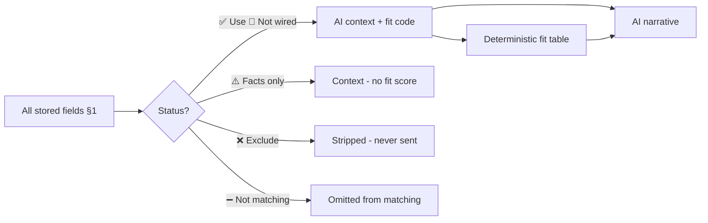

# AI Matching Criteria Policy

**Last updated:** 2026-06-05  
**Related:** [tenant-landlord-matching-data.md](./tenant-landlord-matching-data.md), [Non-Discrimination Policy](/non-discrimination)

## How to read this document

This doc starts from **every piece of data the platform stores** that could theoretically influence tenant–landlord matching, then works **backwards** to mark what must be excluded.

Each criterion has a **matching status**:

| Status | Meaning |
|--------|---------|
| **✅ Use** | Safe for matching, fit tables, browse filters, and AI context |
| **❌ Exclude** | Discriminatory / protected - never use for matching, scoring, or AI fit/reject advice |
| **⚠️ Facts only** | May appear as neutral context; must not drive fit scores or rejection |
| **➖ Not matching** | Operational, legal, display, or payment data - out of scope for preference matching |
| **🔲 Not wired** | Legitimate matching data exists but is not yet used in code or AI |

**Objective:** Train AI to use all **✅ Use** and **🔲 Not wired** criteria, respect **⚠️ Facts only** limits, and never touch **❌ Exclude**.

---

## Table of contents

1. [Master criteria inventory](#1-master-criteria-inventory)
2. [Summary: what to use after exclusions](#2-summary-what-to-use-after-exclusions)
3. [Why each exclusion applies](#3-why-each-exclusion-applies)
4. [AI surfaces and architecture](#4-ai-surfaces-and-architecture)
5. [Implementation status](#5-implementation-status)
6. [Recommended next steps](#6-recommended-next-steps)
7. [Source files](#7-source-files)

---

## 1. Master criteria inventory

### 1.1 Tenant / renter (`student_profiles`)

| Field | Could match against | Matching status | Notes |
|-------|---------------------|-----------------|-------|
| `budget_min_per_week`, `budget_max_per_week` | `rent_per_week`, surcharges | **✅ Use** | Core budget fit; wired in AI assessment |
| `room_type_preference` | `room_type` | **✅ Use** | Browse filter exists; profile not auto-applied |
| `preferred_move_in_date` | `available_from`, `available_to` | **✅ Use** | Browse date filter; booking fit table |
| `move_in_flexibility` | `available_from` | **✅ Use** | Slack logic in fit table |
| `preferred_lease_length` | `lease_length` | **✅ Use** | Fit table |
| `occupancy_type` | `max_occupants`, `room_type`, `property_type` | **✅ Use** | Fit table |
| `furnishing_preference` | `furnished` | **✅ Use** | Fit table |
| `bills_preference` | Bills-included feature | **✅ Use** | Fit table |
| `has_pets` | Pet-friendly feature, house rule “Pets” | **✅ Use** | Fit table |
| `needs_parking` | `parking_available`, parking features | **✅ Use** | Fit table |
| `is_smoker` | House rule “No smoking” | **✅ Use** | Legitimate functional requirement per policy; narrative in AI, not yet in fit table |
| `university_id`, `campus_id` | Listing uni/campus, geo distance | **✅ Use** | Browse filters; campus proximity |
| `workplace_latitude`, `workplace_longitude` | Listing lat/lon | **✅ Use** | Professional renter near-work search |
| `workplace_address`, `workplace_suburb`, `workplace_state`, `workplace_postcode` | Listing location | **✅ Use** | Geocoding input for near-work |
| `workplace_label` | - | **➖ Not matching** | Display label |
| `languages_spoken` | Landlord `languages_spoken` | **🔲 Not wired** | Communication fit; must not proxy nationality |
| `accommodation_verification_route` | `open_to_non_students` | **✅ Use** | Eligibility gate (student vs non-student path) |
| `verification_type` | Platform eligibility | **✅ Use** | Trust tier; not a preference score |
| `uni_email_verified`, `work_email_verified` | - | **✅ Use** | Verification completeness |
| `id_submitted_at`, `enrolment_submitted_at`, `identity_supporting_submitted_at` | - | **✅ Use** | Trust signals |
| `has_guarantor`, `guarantor_name` | - | **✅ Use** | Financial assurance (narrative) |
| `course`, `year_of_study`, `study_level` | - | **⚠️ Facts only** | Tenancy/verification context; not fit/reject |
| `student_type` (`domestic` / `international`) | - | **❌ Exclude** | Proxy for national origin; policy forbids “no international students” |
| `gender` | - | **❌ Exclude** | Protected: sex / gender identity |
| `nationality` | - | **❌ Exclude** | Protected: race / national or ethnic origin |
| `date_of_birth` | - | **❌ Exclude** | Protected: age (and indirect age discrimination) |
| `first_name`, `last_name`, `full_name` | - | **➖ Not matching** | Identity / display; AI uses first name only for tone |
| `email`, `phone` | - | **➖ Not matching** | Contact |
| `avatar_url`, `bio` | - | **➖ Not matching** | Display; bio is soft AI context only |
| `emergency_contact_*` | - | **➖ Not matching** | Safety / lease docs |
| `uni_email`, `work_email` | - | **➖ Not matching** | Verification process |
| `id_document_url`, `enrolment_doc_url`, etc. | - | **➖ Not matching** | Document storage |
| `stripe_customer_id` | - | **➖ Not matching** | Payments |
| `onboarding_complete`, `terms_accepted_at` | - | **➖ Not matching** | Platform gates |
| `created_at` | - | **➖ Not matching** | Metadata |

---

### 1.2 Landlord (`landlord_profiles`)

| Field | Could match against | Matching status | Notes |
|-------|---------------------|-----------------|-------|
| `languages_spoken` | Tenant `languages_spoken` | **🔲 Not wired** | Communication fit only |
| `verified`, `admin_override_verified` | - | **✅ Use** | Trust badge on listings |
| `suburb`, `state`, `postcode`, `address` | Listing location | **⚠️ Facts only** | Homestay / on-site landlord context |
| `residence_location` | - | **➖ Not matching** | FT6600 compliance |
| `landlord_type` | - | **➖ Not matching** | Business structure |
| `company_name`, `abn` | - | **➖ Not matching** | Legal / compliance |
| `has_landlord_insurance` | - | **➖ Not matching** | Eligibility signal, not preference fit |
| `bio` | - | **➖ Not matching** | Profile display |
| `first_name`, `last_name`, `full_name` | - | **➖ Not matching** | Display |
| `email`, `phone`, `avatar_url` | - | **➖ Not matching** | Contact / display |
| `stripe_connect_*`, `stripe_customer_id` | - | **➖ Not matching** | Payments |
| `onboarding_complete`, `terms_accepted_at`, `non_discrimination_policy_*` | - | **➖ Not matching** | Platform gates |
| `fee_exempt` | - | **➖ Not matching** | Platform config |

Landlords match **through listings**, not as a direct tenant↔landlord pairing.

---

### 1.3 Listing / property (`properties`)

| Field | Tenant match | Matching status | Notes |
|-------|--------------|-----------------|-------|
| `rent_per_week` | Budget | **✅ Use** | Browse + fit |
| `bond` | Budget (indirect) | **✅ Use** | Affordability context |
| `room_type` | `room_type_preference` | **✅ Use** | Browse + fit |
| `property_type` | `occupancy_type` | **✅ Use** | Fit table |
| `furnished` | `furnishing_preference` | **✅ Use** | Browse filter + fit |
| `lease_length` | `preferred_lease_length` | **✅ Use** | Fit table |
| `available_from`, `available_to` | Move-in dates | **✅ Use** | Browse + fit |
| `max_occupants` | `occupancy_type`, `occupant_count` | **✅ Use** | Fit table |
| `couple_surcharge_per_week` | Budget | **✅ Use** | Total rent for couples |
| `parking_available`, `parking_surcharge_per_week` | `needs_parking` | **✅ Use** | Fit table |
| `bedrooms`, `bathrooms` | - | **⚠️ Facts only** | Capacity context |
| `rooms_rented_to_residents` | - | **⚠️ Facts only** | Rooming-house context |
| `university_id`, `campus_id` | Tenant uni/campus | **✅ Use** | Browse filters |
| `latitude`, `longitude` | Workplace / campus geo | **✅ Use** | Near-point search |
| `suburb`, `address`, `state`, `postcode` | Location search | **✅ Use** | Text/suburb browse |
| `distance_to_campus_km` | Campus proximity | **🔲 Not wired** | AI chat context only |
| `open_to_non_students` | `accommodation_verification_route` | **✅ Use** | Eligibility |
| `linen_supplied` | Homestay expectation | **🔲 Not wired** | No tenant preference field yet |
| `weekly_cleaning_service` | Service expectation | **🔲 Not wired** | No tenant preference field yet |
| `listing_type` | - | **⚠️ Facts only** | Category (rent / homestay / student_house) |
| `title`, `description`, `slug`, `images` | Text search | **✅ Use** | Browse `q` filter |
| `featured`, `created_at`, `updated_at` | - | **➖ Not matching** | Sort / display |
| `status` | - | **➖ Not matching** | Gate (`active` only in browse) |
| `landlord_id` | - | **➖ Not matching** | FK to landlord |
| `property_group_id` | - | **➖ Not matching** | Duplicate listings |
| `service_tier` | - | **➖ Not matching** | Platform model |
| `house_rules` (free text) | - | **🔲 Not wired** | Narrative rules |
| `is_registered_rooming_house`, `rooming_house_registration_number` | - | **➖ Not matching** | Legal / tenancy package |
| `smoke_alarm_*`, `water_usage_charged_separately`, `electricity_embedded_network`, `gas_embedded_network`, `strata_*` | - | **➖ Not matching** | Compliance disclosure |

---

### 1.4 Listing features (`property_features` → `features`)

| Feature | Matching status | Notes |
|---------|-----------------|-------|
| **Bills included** | **✅ Use** | Bills fit signal |
| **Pet friendly** | **✅ Use** | Pets fit signal |
| **Parking** | **✅ Use** | Parking fit signal |
| WiFi | **🔲 Not wired** | Amenity preference (no tenant field) |
| Air conditioning | **🔲 Not wired** | Amenity |
| Heating | **🔲 Not wired** | Amenity |
| Washing machine | **🔲 Not wired** | Amenity |
| Dryer | **🔲 Not wired** | Amenity |
| Dishwasher | **🔲 Not wired** | Amenity |
| Gym access | **🔲 Not wired** | Amenity |
| Swimming pool | **🔲 Not wired** | Amenity |
| Balcony | **🔲 Not wired** | Amenity |
| Garden | **🔲 Not wired** | Amenity |
| Study desk | **🔲 Not wired** | Student amenity |
| Near public transport | **🔲 Not wired** | Commute context |

---

### 1.5 House rules (`property_house_rules` → `house_rules_ref`)

Each rule has `permitted`: `yes` | `no` | `approval`.

| Rule | Tenant field | Matching status | Notes |
|------|--------------|-----------------|-------|
| **No smoking** | `is_smoker` | **✅ Use** | Functional requirement; not yet in fit table |
| **Pets** | `has_pets` | **✅ Use** | Features used today; junction not wired |
| **Parking** | `needs_parking` | **✅ Use** | Supplementary to `parking_available` |
| Overnight guests | - | **🔲 Not wired** | No tenant preference field |
| Parties/events | - | **🔲 Not wired** | No tenant preference field |
| Quiet hours | - | **🔲 Not wired** | No tenant preference field |

---

### 1.6 Booking (`bookings`)

Overrides profile when a request exists.

| Field | Matching status | Notes |
|-------|-----------------|-------|
| `move_in_date`, `start_date`, `end_date` | **✅ Use** | Move-in fit (overrides profile) |
| `lease_length` | **✅ Use** | Lease fit |
| `occupant_count` | **✅ Use** | Occupancy fit |
| `parking_selected` | **✅ Use** | Parking fit (overrides profile) |
| `weekly_rent` | **✅ Use** | Budget fit in AI |
| `co_tenant` | **⚠️ Facts only** | Co-applicant details |
| `housemates_count` | **⚠️ Facts only** | Shared-house context |
| `student_message` | **⚠️ Facts only** | Intent; AI context |
| `property_type` | **⚠️ Facts only** | Snapshot at booking |
| `status`, `notes`, `decline_reason`, etc. | **➖ Not matching** | Workflow |
| `stripe_*`, `deposit_*`, `bond_*`, fees | **➖ Not matching** | Payments |
| `ai_assessment` | **➖ Not matching** | Cached AI output |
| `service_tier_at_request`, `service_tier_final` | **➖ Not matching** | Platform model |

---

### 1.7 Reference data

| Table | Matching status | Notes |
|-------|-----------------|-------|
| `universities` | **✅ Use** | Browse filter, listing association |
| `campuses` | **✅ Use** | Browse filter, near-campus anchor |
| `features` | **✅ Use** / **🔲 Not wired** | See §1.4 |
| `house_rules_ref` | **✅ Use** / **🔲 Not wired** | See §1.5 |

---

### 1.8 Protected attributes not stored (must never infer)

These are named in the [Non-Discrimination Policy](/non-discrimination) but are **not** database fields. AI must not infer or use them for matching:

| Attribute | Matching status |
|-----------|-----------------|
| Race, colour, descent, ethnic origin | **❌ Exclude** |
| Religion, religious belief or activity | **❌ Exclude** |
| Sexual orientation, lawful sexual activity | **❌ Exclude** |
| Intersex status, gender expression | **❌ Exclude** |
| Disability (physical, intellectual, psychiatric, sensory) | **❌ Exclude** |
| Marital, relationship, or family status | **❌ Exclude** |
| Pregnancy, breastfeeding | **❌ Exclude** |
| Political belief or activity | **❌ Exclude** |
| Source of income / employment status (as exclusion basis) | **❌ Exclude** |
| Receipt of government benefits (as exclusion basis) | **❌ Exclude** |

### 1.9 Discriminatory listing language (forbidden)

Even if not stored as fields, these **patterns in listings or messages** are excluded:

| Pattern | Matching status |
|---------|-----------------|
| “No international students” | **❌ Exclude** |
| “Aussies only” / nationality preferences | **❌ Exclude** |
| “Working professionals only” (to exclude protected groups) | **❌ Exclude** |
| Any preference for or against a protected attribute | **❌ Exclude** |

---

## 2. Summary: what to use after exclusions

Working back from the full inventory, these are the criteria **AI and matching logic should use**:

### Core preference fit (✅ Use - 12 tenant↔listing pairs)

1. Budget ↔ rent (+ surcharges)
2. Room type preference ↔ room type
3. Move-in date + flexibility ↔ availability
4. Lease length ↔ lease length
5. Occupancy ↔ max occupants / room type / property type
6. Furnishing preference ↔ furnished
7. Bills preference ↔ bills-included signal
8. Pets ↔ pet-friendly signal
9. Parking need ↔ parking on listing
10. Smoking ↔ no-smoking house rule
11. Uni/campus ↔ listing uni/campus + geo
12. Workplace ↔ listing geo (professional renters)

### Eligibility and trust (✅ Use - not preference scores)

- Verification tier and steps
- `open_to_non_students` vs accommodation route
- Landlord verified badge
- Guarantor presence

### Legitimate but not yet wired (🔲 - safe to add)

- Language overlap (tenant ↔ landlord)
- General amenities (WiFi, AC, study desk, etc.)
- Structured house rules (guests, parties, quiet hours)
- `distance_to_campus_km` as browse sort/filter
- Linen / cleaning service (needs tenant preference fields)
- Profile budget → default browse filter

### Excluded from matching entirely (❌)

| Stored field | Reason |
|--------------|--------|
| `gender` | Protected characteristic |
| `nationality` | Protected characteristic |
| `date_of_birth` | Age - protected |
| `student_type` | National-origin proxy; policy forbids “no international students” |

Plus all non-stored protected attributes (§1.8) and forbidden listing language (§1.9).

### Facts only - never fit/reject (⚠️)

- `course`, `year_of_study`, `study_level`
- `listing_type`, `bedrooms`, `bathrooms`, `rooms_rented_to_residents`
- Booking `co_tenant`, `housemates_count`, `student_message`

---

## 3. Why each exclusion applies

| Excluded item | Legal / policy basis |
|---------------|---------------------|
| `gender` | Sex Discrimination Act 1984 (Cth); state equal opportunity laws |
| `nationality` | Racial Discrimination Act 1975 (Cth) - nationality, national origin, ethnicity |
| `date_of_birth` | Age Discrimination Act 2004 (Cth); using age to exclude tenants |
| `student_type` (domestic/international) | Quni Non-Discrimination Policy §Listings - explicitly forbids “no international students”; international status is a proxy for national origin |
| Non-stored protected attributes | Quni Non-Discrimination Policy §What this means - full protected-attribute list |
| Discriminatory listing wording | Quni Non-Discrimination Policy §Listings and communication |

**What remains legitimate:** Functional tenancy requirements - affordability, non-smoking household, pets policy, parking, lease length, move-in dates, occupancy limits, furnishing, bills arrangement. These are preference and logistics, not protected-attribute exclusion.

---

## 4. AI surfaces and architecture

### AI surfaces

| Surface | File | Receives today | Should receive (after allowlist) |
|---------|------|----------------|----------------------------------|
| Student chat | `api/chat.ts` | Listing facts only | Listing facts + **✅ Use** tenant preferences |
| Landlord assessment | `api/ai/student-assessment.ts` | Profile subset + fit summary | Same, minus **❌ Exclude** fields |
| Landlord chat | `api/chat.ts` | General guidance | + RAG matching policy article |
| Visitor chat | `api/chat.ts` | Nothing | Unchanged |

### Architecture

**Principle:** Code computes fit for **✅ Use** fields. AI explains results. AI never sees **❌ Exclude** fields.

### Prompt rules already in place

- Student chat: no protected characteristics; never infer sensitive attributes
- Landlord chat: never recommend rejecting based on protected characteristics
- Landlord assessment: no nationality, gender, or protected characteristics; no reject advice on protected grounds

---

## 5. Implementation status

| Criterion group | Stored | In fit table | In AI | Excluded correctly |
|-----------------|--------|--------------|-------|-------------------|
| 7 core fit dimensions | Yes | Yes | Yes | - |
| Smoking (`is_smoker`) | Yes | No | Yes (narrative) | - |
| `gender`, `nationality` | Yes | - | Prompt ban | Partial - still in landlord UI |
| `student_type` | Yes | - | Yes (sent) | **No - should be excluded from fit** |
| `date_of_birth` | Yes | - | Not sent | Yes |
| Languages | Yes | No | No | - |
| Amenities (general) | Yes | No | No | - |
| House rules junction | Yes | Partial | No | - |
| Student chat preferences | Yes | - | **Not sent** | - |
| Central allowlist module | - | - | **Not built** | - |

---

## 6. Recommended next steps

1. **`src/lib/aiMatchingCriteria.ts`** - encode §1 status column as code (`USE` / `EXCLUDE` / `FACTS_ONLY` / `NOT_MATCHING` / `NOT_WIRED`)
2. **Student chat** - add `TENANT PREFERENCE CONTEXT` built from **✅ Use** fields only
3. **Landlord assessment** - stop sending `student_type`; add explicit exclusion rule
4. **Landlord UI** - remove `nationality` (and `gender` if shown) from `LandlordStudentProfileModal`
5. **Fit table** - add smoking row; optionally language overlap as informational
6. **RAG article** - sync this doc to knowledge base for chat consistency

---

## 7. Source files

| Area | Path |
|------|------|
| Full field catalog | [tenant-landlord-matching-data.md](./tenant-landlord-matching-data.md) |
| Non-Discrimination Policy | `src/pages/NonDiscrimination.tsx` |
| Student / landlord chat | `api/chat.ts` |
| Landlord assessment | `api/ai/student-assessment.ts` |
| Booking fit table | `src/lib/bookingFitSummary.ts`, `api/lib/bookingFitForAssessment.ts` |
| Landlord applicant UI | `src/components/landlord/LandlordStudentProfileModal.tsx` |
| Database types | `src/lib/database.types.ts` |

---

*Start from §1 (everything). Apply §2 (what remains after exclusions). Implement via §4–§6.*
