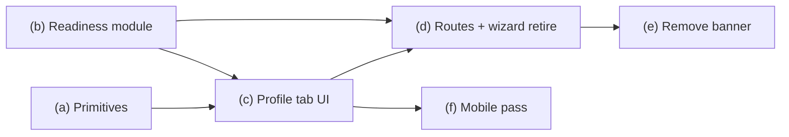

# Landlord dashboard consolidation — audit & staged plan

**Status:** Audit only (no code, routes, migrations, or deploy).  
**Visual source of truth:** `docs/Design/landlord-profile/LandlordProfile.dc.html` and `docs/Design/landlord-profile/Quni Landlord Profile.dc.html` (ignore mockup top bar; keep shared site nav).

**Locked decisions:** Profile merges into `/landlord/dashboard` as tab 4 (`Listings | Messages | Bookings | Profile`); retire `/landlord-profile`; absorb `/onboarding/landlord` into Profile tab; unified `landlordProfileReadiness`; domain-agnostic collapse + pinned-driver primitives; no schema migration expected.

---

## Executive summary

Today landlords are split across three surfaces: a 5-step wizard (`/onboarding/landlord`), a standalone profile page (`/landlord-profile` + alias `/landlord/profile`), and a dashboard with a hardcoded 7-item checklist plus `OnboardingChecklistBanner`. Readiness logic is duplicated in at least four places and **does not match the design publish gate** (missing address and photo in `canLandlordCreateListing`). Route guards use `onboarding_complete` (set only when the wizard reaches step 5), which blocks first-run landlords from the dashboard and from `/landlord/property/new` until the wizard finishes — the highest behavioural risk in this merge.

The build introduces one readiness module, reusable UI primitives (mirroring future renter Stage 4), a Profile tab reproducing the `.dc.html` two-threshold layout, then retires the wizard and old routes.

**Migration:** None required. All fields exist on `landlord_profiles` (including `residence_location`, `languages_spoken`, `has_landlord_insurance`, `insurance_acknowledged_at`, Stripe columns, agreement timestamps).

---

## 1. References to `/landlord-profile` and `LandlordProfile`

### Routes & lazy loading

| Location | Current | Becomes |
|----------|---------|---------|
| `src/App.tsx:207–212` | `path="/landlord-profile"` → `<Lazy.LandlordProfile />` under `ProtectedRoute` | `<Navigate to="/landlord/dashboard?tab=profile" replace />` (preserve hash) |
| `src/App.tsx:214–220` | `path="/landlord/profile"` → same component | Same redirect; optional hash mapping (`#account-agreements` → profile section id) |
| `src/lazyPages.ts:18,94` | Lazy import `./pages/LandlordProfile` | Remove after page deleted; Profile tab uses new component |
| `src/lib/routePrefetch.ts:66–67` | Prefetch keys `/landlord-profile`, `/landlord/profile` | `/landlord/dashboard?tab=profile` or drop prefetch for retired paths |
| `src/lib/LandlordDashboardRedirect.tsx:6` | Legacy `/landlord-dashboard` → `/landlord/dashboard` + hash | Unchanged |

### Navigation & deep links

| Location | Current | Becomes |
|----------|---------|---------|
| `src/components/Header.tsx:239–243` | Avatar dropdown **Profile** → `/landlord-profile` | `/landlord/dashboard?tab=profile` |
| `src/components/Header.tsx:15–18,472,623` | **Finish setup** → `/onboarding/landlord` | `/landlord/dashboard?tab=profile` (pinned driver names gaps) |
| `src/lib/userDashboardNav.ts:14–16` | `userDashboardProfilePath('landlord')` → `/landlord/profile` | `/landlord/dashboard?tab=profile` |
| `src/lib/onboardingChecklist.ts:200,207,214` | Checklist agreement steps → `/landlord-profile#account-agreements` | `/landlord/dashboard?tab=profile#agreements` (or section id used in Profile tab) |
| `src/lib/onboardingChecklist.ts:221` | Profile step → `/landlord/profile` | `/landlord/dashboard?tab=profile` |
| `src/pages/LandlordDashboard.tsx:929–935` | `firstIncomplete` agreement links → `/landlord-profile#account-agreements`; field links → `/landlord/profile` | All → `/landlord/dashboard?tab=profile` + section hash |
| `src/pages/LandlordDashboard.tsx:960,1010,1165` | Error / gated CTA links → `/landlord-profile` or `/landlord/profile` | `/landlord/dashboard?tab=profile` |
| `src/pages/landlord/LandlordPropertyFormPage.tsx:2338` | “Go to profile” → `/landlord-profile` | `/landlord/dashboard?tab=profile` |
| `src/components/landlord/LandlordStripePayoutsCard.tsx:265` | Link → `/landlord/profile` | `/landlord/dashboard?tab=profile` (payouts section) |

### Post-auth landing

| Location | Current | Becomes |
|----------|---------|---------|
| `src/lib/authProfile.ts:161–162` | Post-login landlord incomplete → `/onboarding/landlord` | `/landlord/dashboard?tab=profile` |
| `src/lib/authProfile.ts:184–185` | Nav dashboard incomplete → `/onboarding/landlord` | `/landlord/dashboard` (dashboard reachable; Profile tab shows driver) |
| `src/lib/authProfile.ts:216,232,250–252` | `needsOnboarding` / `getIncompleteOnboardingDestination` / `getPostAuthEntryDestination` → `/onboarding/landlord` | Live readiness (no wizard); destination `/landlord/dashboard?tab=profile` when publish gate incomplete, else `/landlord/dashboard` |
| `src/pages/Login.tsx:127` | Incomplete landlord → `/onboarding/landlord` | `/landlord/dashboard?tab=profile` |
| `src/pages/Signup.tsx:349` | Landlord signup → `/onboarding/landlord` | `/landlord/dashboard?tab=profile` |
| `src/pages/auth/AuthCallback.tsx:81,100` | Verify-email / incomplete → `/onboarding/landlord` | `/landlord/dashboard?tab=profile` |
| `src/components/ProtectedRoute.tsx:87–88` | `onboarding_complete !== true` → `/onboarding/landlord` | **Remove or replace** (see §3) |

### Dashboard `?tab=` deep links

| Location | Current | Becomes |
|----------|---------|---------|
| `src/pages/LandlordDashboard.tsx:847–852` | `?tab=bookings\|listings`; `?tab=enquiries` → `/messages` | Add `?tab=profile`; keep bookings/listings/enquiries behaviour |
| `src/lib/userDashboardNav.ts:29–31` | `landlordBookingsPath()` → `?tab=bookings` | Unchanged |
| `src/components/dashboard/UserDashboardSectionNav.tsx:26–77` | Tabs: Listings, Messages (link), Bookings (link) — **no Profile** | Add **Profile** tab button → `?tab=profile` |

### SEO / config / docs (non-runtime)

| Location | Notes |
|----------|-------|
| `src/lib/site.ts:57` | Private path prefix `/landlord-profile` — add or replace with query-aware note; `/landlord/dashboard` already private |
| `public/robots.txt:12` | `Disallow: /landlord-profile` — keep redirect route disallow or remove after redirect only |
| `docs/feature-inventory.md:328`, `scripts/knowledgeData.json` | Update in a docs pass (not blocking build) |

### Tests

| Location | Notes |
|----------|-------|
| `src/lib/landlordListingBondReceivedGate.test.ts:5` | String `'landlord-profile-uuid'` — **not a route reference**; no change |
| No tests reference `/landlord-profile` URL today | Add tests in stage (b) for `landlordProfileReadiness` and redirect smoke in stage (d) |

### `LandlordProfile` component (page file)

| Location | Role today | Build action |
|----------|------------|--------------|
| `src/pages/LandlordProfile.tsx` | Full page: Profile \| Properties tabs, `landlordProfileCompletionStats`, draft autosave, agreements, photo, languages, listings via `useLandlordPropertyListingActions` | **Delete page** after Profile tab absorbs profile sections; **do not** port Properties tab |
| `src/pages/LandlordProfile.tsx:196–209` | `landlordProfileCompletionStats` (4-item %: personal, bank, bio, photo) | **Replace** with `landlordProfileReadiness` |
| `src/pages/LandlordProfile.tsx:884–917` | Duplicate Properties tab | **Delete** — Listings tab owns listings |
| `src/pages/LandlordProfile.tsx:612–616,1375–1475` | Properties tab uses shared listing hook | Safe to delete; dashboard Listings tab keeps same hook |

Other `LandlordProfileRow` / API `LandlordProfileSlice` types are **DB row types**, not the page — unchanged.

---

## 2. Wizard internals (`LandlordOnboarding.tsx`)

### Five steps — what each WRITES

| Step | UI | DB / side effects | Key code |
|------|-----|-------------------|----------|
| **1 — Profile** | Photo, name, phone, landlord type, company/ABN, address, bio | **Photo:** `landlord-avatars` storage upload → `landlord_profiles.avatar_url` (`518–519`). **Form submit:** `first_name`, `last_name`, `full_name`, `phone`, `landlord_type`, `company_name`, `abn`, `address`, `suburb`, `postcode`, `state`, `bio` — update or insert row (`556–606`). | `saveStep1`, `handlePhotoChange` |
| **2 — Terms** | ToS, Landlord Service Agreement, Non-discrimination | `terms_accepted_at`, `landlord_terms_accepted_at`, `nonDiscriminationAcceptancePatch(now)` (`643–647`) | `saveStep2` |
| **3 — Payments** | Listing: save card (+ optional Connect skip); Managed: Stripe Connect | **Connect:** `POST /api/create-connect-account-link` with `returnContext: 'landlord_onboarding'` → Stripe hosted flow; status synced via return handler + webhook. **Card:** `LandlordListingPaymentModal` → `POST /api/landlord-stripe-setup-complete` with `setupIntentId` (sets `stripe_customer_id` + default PM server-side). **No direct profile write on skip** — `stripeSkippedForNow` is draft-only local state (`1182–1183`). | `startStripeConnect`, modal `onSuccess` |
| **4 — Insurance** | Checkbox + provider links | `has_landlord_insurance`, `insurance_acknowledged_at` (`727–729`) — **optional for gates** | `saveStep4` |
| **5 — Complete** | Celebration + links to listing / dashboard | **`onboarding_complete: true`, `onboarding_completed_at: now`** (`469–472`); `setLandlordWizardCompleteLocalStorage()`; clears `landlord_onboarding_draft` | `useEffect` when `step === 5` (`458–492`) |

**Step routing after save:** Step 1 → step 2 or 3 if terms already complete (`617–618`). Step 2 → 3. Step 3 Connect success auto-advances to 4 after 2s if charges enabled (`449–456`). Step 4 → 5.

### Draft autosave

- **Key:** `landlord_onboarding_draft` (`LandlordOnboarding.tsx:52`).
- **Shape:** `LandlordOnboardingDraftV1` — step, names, phone, type, company, ABN, address fields, bio, `avatarUrl`, `hasInsurance`, `stripeSkippedForNow`; **terms checkboxes never persisted** (`58–59`).
- **Mechanism:** 500ms debounced write on state change (`334–346`); flush on `visibilitychange` / `pagehide` (`348–364`); restore on load if meaningful (`327–331`); cleared on wizard complete (`485–487`, `388–393`).
- **Absorption:** Profile tab sections should use **per-section save to DB** (like current `LandlordProfile.tsx` save handlers). Retire wizard draft key or migrate to a profile-tab draft key only for in-progress form fields — do not lose photo URL / step position semantics for first-run UX.

### Stripe Connect return query params

| Context | Return URL | Handler |
|---------|------------|---------|
| Wizard | `/onboarding/landlord?stripe_connect=success\|refresh` (`api/create-connect-account-link.js:62–63`) | `LandlordOnboarding.tsx:414–447`: `refresh` → error message; `success` → `POST /api/sync-stripe-connect-status`, reload profile, strip params |
| Dashboard (existing) | `/landlord/dashboard?stripe_connect=return\|refresh` (`create-connect-account-link.js:55–56`) | `LandlordDashboard.tsx:838–844` |

**Absorption:** Profile tab payouts section should use **`returnContext: 'landlord_dashboard'`** (or new `'landlord_profile'`) with return to `/landlord/dashboard?tab=profile&stripe_connect=success` and the same sync effect as dashboard.

### Where `onboarding_complete = true` is set today

1. **Primary:** Wizard step 5 mount effect — `LandlordOnboarding.tsx:458–492`.
2. **Secondary:** `OnboardingChecklistBanner` when checklist fully complete — writes `onboarding_complete: true` to `landlord_profiles` (`OnboardingChecklistBanner.tsx:129–131,145–148`).
3. **Load guard:** Wizard redirects away if already complete — `LandlordOnboarding.tsx:388–395`.

---

## 3. `ProtectedRoute` landlord guard — behavioural risk

### Today

```84:89:src/components/ProtectedRoute.tsx
  if (role === 'landlord' && profile) {
    const lp = profile as LandlordProfileRow
    const path = location.pathname
    if (lp.onboarding_complete !== true && !path.startsWith('/onboarding/landlord')) {
      return <Navigate to="/onboarding/landlord" replace />
    }
```

- Applies to **every** landlord protected route, including `/landlord/dashboard` and `/landlord/property/new` (`App.tsx:191–227`).
- Only escape hatch: `/onboarding/landlord` (and anything under that prefix).
- **`/landlord/property/new` is blocked** for first-run landlords until wizard step 5 sets `onboarding_complete` — even though the property form itself only checks that a `landlord_profiles` row exists (`LandlordPropertyFormPage.tsx:2055–2057`), not wizard completion.

### Related auth helpers (same boolean)

- `landlordNeedsOnboardingWizard` / `isLandlordWizardComplete` — `src/lib/landlordOnboarding.ts:18–26` (`onboarding_complete === true`).
- Used by `getPostLoginRedirectDestination`, `getNavDashboardPath`, `needsOnboarding`, `getPostAuthEntryDestination` — `src/lib/authProfile.ts:161–252`.

### Recommended post-merge behaviour

**Routing (mirror renter):** Use **live field readiness**, not `onboarding_complete`, for “can access app shell” decisions — same pattern as `renterOnboardingIncomplete` ignoring the boolean (`src/lib/studentOnboardingRouting.test.ts:97–102`).

1. **Remove** the `ProtectedRoute` block at lines 84–89 entirely, **or** replace with: allow all authenticated landlords with a profile row to reach `/landlord/dashboard`, `/landlord/property/new`, `/landlord/property/edit/:id`, `/landlord/bookings/:id/review`, `/messages`, etc.
2. **First-run landlords** land on `/landlord/dashboard?tab=profile` (signup/login/auth callback changes in §1).
3. **Listing creation** stays gated in UI via `canLandlordCreateListing` / readiness module (dashboard CTAs, property form can add server-side check later if needed — out of scope unless requested).
4. **`/onboarding/landlord`:** Redirect to `/landlord/dashboard?tab=profile` (stage d).

### What `onboarding_complete` should mean post-merge

| Option | Pros | Cons |
|--------|------|------|
| **A. Retire for routing** (recommended) | Single source of truth in readiness module; no stale flags | Admin timeline / journey event still reads column |
| **B. Auto-set when publish gate met** | Keeps `journey_events` trigger (`supabase/migrations/20260621150000_journey_events_signup_triggers.sql:154–171`) meaningful; admin “onboarding complete” aligns with “can list” | Two concepts unless documented; must not reintroduce route guard |

**Recommendation:** **A for routing** + optional **B as denormalized analytics only** (background write when `canLandlordPublish` flips true, never read for guards). Align `isProfileDashboardOnboardingComplete('landlord', …)` (`onboardingChecklist.ts:44`) with publish or accept gate — not raw boolean.

### Edge cases to preserve

- Landlords mid-wizard with partial DB rows: dashboard Profile tab shows filled sections from DB + infers open section from readiness.
- Stripe return mid-flow: query param handler on dashboard Profile tab, not wizard route.
- Email verification pending: unchanged (`ProtectedRoute.tsx:65–67`).
- Admin on property form: unchanged (`allowedRoles: ['landlord', 'admin']`).

---

## 4. Publish gate — `canLandlordCreateListing` and photo

### Current implementation

```123:141:src/lib/onboardingChecklist.ts
export function isLandlordProfileBasicsComplete(p: LandlordProfileRow | null | undefined): boolean {
  if (!p) return false
  return landlordDisplayNameComplete(p) && Boolean(p.phone?.trim()) && Boolean(p.bio?.trim())
}

export function canLandlordCreateListing(p: LandlordProfileRow | null | undefined): boolean {
  if (!p) return false
  return Boolean(
    p.terms_accepted_at &&
      p.landlord_terms_accepted_at &&
      landlordNonDiscriminationAccepted(p) &&
      isLandlordProfileBasicsComplete(p),
  )
}
```

**Gap vs locked publish gate (Personal details, Address, About you with photo + bio, Agreements):**

| Requirement | In `canLandlordCreateListing` today? |
|-------------|--------------------------------------|
| Personal details (name, phone, type, company/ABN when needed) | Partial — name + phone only |
| Address (street, suburb, postcode, state; `residence_location` when non-NSW) | **No** |
| About you — bio | Yes |
| About you — photo | **No** |
| Agreements (3 acceptances) | Yes |

The dashboard **7-step widget** (`LandlordDashboard.tsx:914–926`) already tracks photo separately but **does not feed** `canLandlordCreateListing` (`938`).

### One-line photo change (requested)

Add to `isLandlordProfileBasicsComplete`:

```typescript
&& Boolean(p.avatar_url?.trim())
```

Or add `&& Boolean(p.avatar_url?.trim())` inside `canLandlordCreateListing` after `isLandlordProfileBasicsComplete(p)`.

**Stage (b) should also add address** (and `landlord_type` / conditional company fields) to publish predicates in `landlordProfileReadiness` — align with `landlordStep1FieldsComplete` in `landlordOnboarding.ts:34–45` plus photo, minus insurance.

### Consumers of `canLandlordCreateListing`

| File | Usage | Effect of photo gate |
|------|-------|----------------------|
| `src/lib/onboardingChecklist.ts:134–141` | Definition | Gate tightens |
| `src/lib/onboardingChecklist.ts:145–146` | `isLandlordListingUnlocked` (publish + Stripe payouts) | Also tightens (payouts unchanged) |
| `src/pages/LandlordDashboard.tsx:938,1001–1015,1156–1165` | “Add new listing” CTA enable / empty state | Button stays disabled → deep link to profile until photo saved |

**Not using `canLandlordCreateListing` today:** `LandlordPropertyFormPage.tsx` (no import) — landlords can open `/landlord/property/new` if route guard allows, even when gate false. Consider optional guard in stage (d) using same module.

### Replacements (stage b)

| Retire | Replace with |
|--------|----------------|
| `landlordProfileCompletionStats` (`LandlordProfile.tsx:196–209`) | `landlordProfileReadiness` sections + fractions |
| `buildLandlordOnboardingSteps` / `landlordChecklistFraction` (`onboardingChecklist.ts:173–258`, `OnboardingChecklistBanner`) | Readiness-driven driver + optional legacy export during transition |
| Hardcoded 7-step widget (`LandlordDashboard.tsx:914–926`) | `readiness.publishProgress` for stat card |

---

## 5. Accept gate — unchanged

**UI surfaces status only; does not re-implement accept logic.**

| Layer | Gate | Listing tier extras |
|-------|------|---------------------|
| `src/lib/landlordBookingConfirmGate.ts:20–29,104–112` | `stripe_charges_enabled` (identity via Connect) unless admin override | Saved card via `listingBilling.hasPaymentMethod` (`74–80`) |
| `api/lib/booking/confirmListing.ts:114–118` | `host_identity_not_ready` if Connect identity not ready | `stripe_customer_id` + default PM (`154–159`) |
| `api/confirm-booking.ts:244` | Same error surface | Branches to listing vs managed |
| `src/pages/landlord/LandlordBookingReviewPage.tsx:995,1212` | `host_identity_required` banner | Uses gate helpers only |

Profile tab **Payouts & identity** section should display: Connected / Identity verified / saved card — reading `stripe_charges_enabled`, `stripe_payouts_enabled`, listing billing snapshot (`LandlordListingPaymentModal` / existing dashboard listing billing load), **without** duplicating confirm API rules.

---

## 6. Duplicate Properties tab vs dashboard Listings

| | `LandlordProfile` Properties tab | `LandlordDashboard` Listings tab |
|--|----------------------------------|----------------------------------|
| Hook | `useLandlordPropertyListingActions` (`LandlordProfile.tsx:612–616`) | Same hook (`LandlordDashboard.tsx:810`) |
| UI | `LandlordPropertyListingActions` per row (`1444–1468`) | Same component (`1239+`) |
| Modals | `LandlordDuplicateListingModal`, invite modal pattern | Same (`1598+`) |
| Data | Profile page loads listings subset | Dashboard loads `properties` in main `load()` |

**Conclusion:** Shared components/hooks — **Properties tab can be deleted safely** with no loss of listing management capability. Listings tab is strictly superset (stats, tier mix, dashboard context).

---

## 7. RLS and route guards specific to `/landlord-profile`

- **No RLS policies** reference `/landlord-profile` path. Landlord data uses generic policies on `landlord_profiles` (`supabase/quni_supabase_schema.sql:292–293` — “Users manage own landlord profile”, “Public can read landlord profiles”).
- **Route guard:** Only `ProtectedRoute` `allowedRoles={['landlord']}` on both profile paths (`App.tsx:207–220`) — same as dashboard.
- **Storage:** `landlord-avatars` bucket RLS (referenced in error copy `LandlordProfile.tsx:650–651`) — applies to photo upload from any page, not route-specific.
- **SEO:** `isSeoPrivatePath` includes `/landlord-profile` (`site.ts:57`).

Retiring the route has **no RLS migration**; redirects preserve bookmarks.

---

## 8. Capacitor / mobile

Mirror patterns from `src/pages/Booking.tsx`:

| Pattern | Booking reference | Apply to Profile tab |
|---------|-------------------|------------------------|
| Safe-area bottom padding | `[padding-bottom:max(1.5rem,env(safe-area-inset-bottom))]` (`Booking.tsx:264`) | Pinned driver footer + page shell |
| Keyboard inset | `visualViewport` listeners (`Booking.tsx:1147–1164`); dynamic `paddingBottom` when inset > 0 (`1794–1795`) | Active section with inputs (personal, address, bio, agreements) |
| Step bottom padding | `pb-20` / `max-md:pb-[min(42dvh,19rem)]` (`1805`) | Profile tab scroll container above pinned driver |
| Expand → scroll + focus | `scrollIntoView({ block: 'center', behavior: 'smooth' })` on fields (`474,649,2073`) | On section expand: scroll section header into view; focus first invalid field on save error |
| Sticky pinned driver | N/A (booking uses step chrome) | `position: sticky; top: 0` per design (`.dc.html:18`) + `safe-area-inset-top` on Capacitor |

**Dashboard shell:** Existing tabs (`listings`, `bookings`) must still render under new layout — no tab-internal changes in this build except adding Profile tab wrapper padding.

**Note:** Dashboard currently has `pb-16` (`LandlordDashboard.tsx:970`) — Profile tab with sticky driver may need larger bottom inset in stage (f).

---

## Design spec checklist (from `.dc.html`)

Profile tab must include:

1. **Pinned driver** — eyebrow, title, active fraction, two-step milestone (Publish / Accept), progress bar, phases 1–3 copy.
2. **Step 1 group** — Personal details, Address, About you (photo + bio), Agreements — collapse-on-complete with Done / To do / summary row.
3. **Threshold marker** — locked vs cleared publish threshold.
4. **Step 2 group** — Payouts & identity (Connect + listing-tier card + identity badge).
5. **Optional divider** — Insurance, Languages spoken (**never gate**).
6. **Footer** — “Add a listing” CTA gated on publish readiness.

Seeds in `Quni Landlord Profile.dc.html`: `publish`, `listed`, `complete` — implement all driver phases and section states.

---

## Staged build plan (one Cursor session each)

Order follows dependencies. Each stage: `npx tsc -b --noEmit`, commit when requested, no migration.

### Stage (a) — Shared collapse + pinned-driver primitives

**Scope:** New domain-agnostic components/hooks, e.g. `ProfileSectionAccordion`, `ReadinessPinnedDriver` — props: `sections[]`, `isSectionComplete`, `driverPhase`, `milestones`, `onSectionToggle`, no landlord imports.

**Reference:** Design `.dc.html` structure; renter Stage 4 in `docs/renter-onboarding-build-plan.md`.

**Exit criteria:**
- Storybook-style fixture or unit test with mock sections renders collapsed/expanded/summary states.
- Driver renders two-threshold track + 3 phase copy slots from props alone.
- Zero imports from `landlord_profiles` types in primitive files.

---

### Stage (b) — `landlordProfileReadiness` + stat card + listing gate

**Scope:** New `src/lib/landlordProfileReadiness.ts` — publish gate, accept gate status, section completeness, driver phase, fractions, deep-link hashes. Extend `canLandlordCreateListing` (photo + address + type fields). Rewire `LandlordDashboard.tsx` stat card (`1079–1114`) and `canCreateListing` CTAs to readiness module. Deprecate inline 7-step math (`914–926`).

**Exit criteria:**
- Unit tests cover publish/accept thresholds, optional insurance/languages never affect gates.
- Dashboard “Your profile” card shows readiness fraction + link to `?tab=profile`.
- `canLandlordCreateListing` matches design publish gate including photo.
- No changes yet to Profile tab UI or wizard routes.

---

### Stage (c) — Profile tab on dashboard (visual spec)

**Scope:** Fourth tab in `UserDashboardSectionNav` + `LandlordDashboard` `tab=profile` handling. New `LandlordDashboardProfileTab` composing primitives + section forms (port field saves from `LandlordProfile.tsx` / wizard step 1–2–4). Reproduce `.dc.html` sections, copy, states, threshold marker, footer CTA. Keep shared site nav; remove duplicate top-level `LandlordStripePayoutsCard` from overview when profile owns payouts (or link from stat card only).

**Exit criteria:**
- All section saves write same columns as wizard/profile page (§2 table).
- Visual parity with design seeds `publish` / `listed` / `complete`.
- Listings | Messages | Bookings tabs unchanged and still render correctly.
- `?tab=profile` and section hashes scroll/open correct section.

---

### Stage (d) — Absorb wizard, retire routes, `ProtectedRoute`, delete Properties tab

**Scope:**
- Redirect `/landlord-profile`, `/landlord/profile`, `/onboarding/landlord`, `/landlord/onboarding` → dashboard profile tab.
- Update all §1 navigation/post-auth targets.
- Remove `ProtectedRoute` onboarding_complete block; update `authProfile.ts` helpers to live readiness.
- Delete `LandlordOnboarding.tsx` route (logic absorbed into Profile tab).
- Delete `LandlordProfile.tsx` page and Properties tab.
- Stripe `returnContext` for profile payouts → dashboard profile tab URL.
- Decide `onboarding_complete` analytics write (optional, on publish gate met).

**Exit criteria:**
- New landlord signup → `/landlord/dashboard?tab=profile` without wizard loop.
- `/landlord/property/new` reachable with incomplete profile (listing still gated by CTA).
- Old URLs redirect with hash preserved where possible.
- No remaining imports of deleted page except redirects/tests updated.

---

### Stage (e) — Remove setup banner

**Scope:** Remove `OnboardingChecklistBanner` from `LandlordDashboard.tsx` (`973–991`). Landlord path in banner can remain for students until renter work — or landlord-only removal.

**Exit criteria:**
- Dashboard never shows “Complete your account setup — X of 7 steps”.
- Pinned driver on Profile tab is sole landlord setup UX.
- `buildLandlordOnboardingSteps` unused by dashboard (can delete or keep for admin until cleanup).

---

### Stage (f) — Mobile pass

**Scope:** Safe-area on pinned driver; keyboard inset on Profile tab; section expand scroll/focus; bottom padding so footer CTA clears driver + iOS home indicator.

**Exit criteria:**
- Manual or automated check: Profile tab usable on narrow viewport with keyboard open.
- Patterns match Booking.tsx references in §8.

---

## Dependency graph



---

## Audit corrections vs “already enforced in code”

The locked decision states publish gate maps to `canLandlordCreateListing`. **Audit finding:** that function is **missing address and photo** today; accept gate **is** correctly centralized in `landlordBookingConfirmGate` + confirm API. Stage (b) closes the publish gate gap without a migration.

---

## Files likely touched (by stage)

| Stage | Primary files |
|-------|----------------|
| a | New `src/components/profileReadiness/*` or similar |
| b | `src/lib/landlordProfileReadiness.ts`, `onboardingChecklist.ts`, `LandlordDashboard.tsx`, tests |
| c | `LandlordDashboard.tsx`, `UserDashboardSectionNav.tsx`, new profile tab component, port from `LandlordProfile.tsx` |
| d | `App.tsx`, `ProtectedRoute.tsx`, `authProfile.ts`, `Header.tsx`, `Login.tsx`, `Signup.tsx`, `AuthCallback.tsx`, `routePrefetch.ts`, `userDashboardNav.ts`, delete wizard + profile page |
| e | `LandlordDashboard.tsx`, possibly `OnboardingChecklistBanner.tsx` |
| f | Profile tab + dashboard shell padding |

**No `supabase/migrations/*` expected.**
