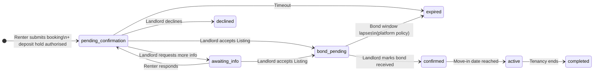

# Quni Listing - process from listing to booking confirmation

**Last updated:** June 2026  
**Scope:** End-to-end flow for **Quni Listing** properties from a live listing through landlord acceptance and platform **booking confirmation** (`confirmed` status).  
**Audience:** Product, support, legal review, and engineering.  
**Code references:** `api/confirm-booking.ts`, `api/lib/booking/confirmListing.ts`, `api/lib/booking/markBondReceived.ts`, `src/pages/landlord/LandlordBookingReviewPage.tsx`

For strategic tier context see [`dual-tier-service-model.md`](./dual-tier-service-model.md). For implementation history see [`phase-3-landlord-listing.md`](./phase-3-landlord-listing.md).

---

## Summary in one paragraph

A landlord publishes a **Listing** property. A renter applies and authorises a **one-week rent deposit hold** on Quni (not captured). The landlord reviews the applicant on the **booking review** page and **accepts as Listing** once Stripe identity and a saved card are ready. Quni charges the landlord **$99** (unless fee-exempt), **releases** the renter’s deposit hold, moves the booking to **`bond_pending`**, emails both parties, and **sends the tenancy agreement for electronic signing** (DocuSeal). Bond is paid **off-platform** (renter’s choice: state bond authority or landlord, where the law requires a scheme). When the landlord records **bond received**, the booking becomes **`confirmed`**. Rent after that is between landlord and renter - Quni does not collect weekly rent on Listing.

---

## Service tier: Listing vs Managed (at accept)

| | **Quni Listing** | **Quni Managed** |
|---|---|---|
| Who runs bond & rent | Landlord ↔ renter directly | Quni facilitates (Stripe Connect, bond per managed rules) |
| Landlord fee at accept | **$99** flat (saved card) | **7%** of weekly rent via subscription path |
| Renter deposit hold at accept | **Cancelled** (released) | **Captured** |
| Status after accept | `bond_pending` | `confirmed` |
| Weekly rent on Quni | No | Yes (subscription) |
| Typical availability | All states | QLD + NSW T1; NSW T2 / VIC gated |

This document focuses on **Listing**. Managed confirm uses the same review UI when offered but branches inside `POST /api/confirm-booking` to the managed path.

---

## Booking status flow (Listing)

**Column meaning:** `confirmed_at` is set when the landlord **accepts** (commitment timestamp). **`confirmed` status** on Listing means bond has been acknowledged on Quni - not the same moment as accept.

---

## Phase 1 - Landlord publishes a Listing property

| Step | Actor | What happens |
|------|--------|----------------|
| 1.1 | Landlord | Completes landlord onboarding (profile, terms, Stripe Connect **identity** for payouts/verification). |
| 1.2 | Landlord | Creates or edits a property with **`service_tier = listing`** (or only Listing offered in that state). |
| 1.3 | Landlord | Sets rent, bond, photos, house rules, property type (drives **tenancy package**: NSW/QLD/VIC agreement template and bond rules). |
| 1.4 | System | Listing goes live on browse/search (`/listings`, `/properties/:slug`). |

**Contact masking:** Until a booking is accepted, renter and landlord contact details stay masked in messaging; full contact unlocks after accept.

---

## Phase 2 - Renter applies for the property

| Step | Actor | What happens |
|------|--------|----------------|
| 2.1 | Renter | Views listing, may use AI chat, starts **Book** flow (`/book/:propertyId` or equivalent). |
| 2.2 | Renter | Chooses move-in, lease length, occupants, rent payment preference (card via Quni or bank transfer where offered). |
| 2.3 | Renter | **Bond step:** Acknowledges bond arrangements. For **statutory bond schemes** (e.g. standard NSW residential), copy explains the landlord must offer paying through the **state authority first**; renter may still pay the landlord directly. NSW links to [Rental Bonds Online](https://www.nsw.gov.au/housing-and-construction/renting/rental-bonds). |
| 2.4 | Renter | Authorises Stripe **PaymentIntent** for **one week’s rent** as a **holding deposit** (`requires_capture` - not taken unless Managed accept path captures it). |
| 2.5 | System | Creates `bookings` row → status **`pending_confirmation`**, stores `service_tier_at_request`, deposit PI id, occupancy snapshot, etc. |
| 2.6 | System | Notifies landlord (email + dashboard **Bookings**). |

**Renter fees:** Renters pay **no** Quni booking/platform fee on Listing; the hold is tenancy money, released on Listing accept.

---

## Phase 3 - Landlord reviews the application

| Step | Actor | What happens |
|------|--------|----------------|
| 3.1 | Landlord | Opens **booking review** (`/landlord/bookings/:id/review`) from dashboard, email deep-link (`#applicant-review`), or bookings list. |
| 3.2 | Landlord | Reviews applicant profile, verification, **fit summary**, optional **AI assessment**, messages, blockers. |
| 3.3 | Landlord | May **request more information** → status **`awaiting_info`** until renter responds. |
| 3.4 | Landlord | May **decline** → `declined` (deposit hold released per decline flow). |

### Prerequisites before **Accept as Listing** is enabled

All must pass (see `landlordBookingConfirmGate.ts`):

| Requirement | Why |
|-------------|-----|
| Booking status `pending_confirmation` or `awaiting_info` | Only open applications |
| **Stripe Connect** - `stripe_charges_enabled` | Identity verification for all landlords before accept |
| **Listing billing module** enabled | Platform flag |
| **Saved payment method** on landlord Stripe customer | **$99** acceptance fee charge |
| Tier selected **Listing** in three-button UI when both tiers shown | State may hide Managed |

If blocked, the review page shows a specific message (e.g. “Verify with Stripe”, “Add a card”).

---

## Phase 4 - Landlord accepts as Listing (`bond_pending`)

**API:** `POST /api/confirm-booking` with `{ booking_id, service_tier: "listing", actor: "landlord" }` → `runListingConfirmBooking()`.

| Step | System action |
|------|----------------|
| 4.1 | Validates landlord, status, Stripe identity, billing. |
| 4.2 | **Cancels** renter’s deposit PaymentIntent (hold released back to renter). |
| 4.3 | Charges landlord **$99** AUD on saved card (skipped if **fee-exempt** landlord). |
| 4.4 | Updates booking: `status = bond_pending`, `service_tier_final = listing`, `confirmed_at = now`, `bond_window_expires_at = now + 7 days` (platform policy; separate from state lodgement deadlines). |
| 4.5 | Inserts `service_tier_events` (`booking_confirmed`, tier `listing`). |
| 4.6 | Sends **acceptance emails** to renter and landlord (`listingTransactionalEmails.js`). |
| 4.7 | **Generates tenancy agreement** (state-appropriate PDF) and **starts DocuSeal signing** for both parties (`defer_signing: false` at accept). Included in the **$99** listing fee. |
| 4.8 | Unlocks **conversation** contact details. |
| 4.9 | Review page shows green **“Booking accepted” / “What happens next”** summary (`LandlordListingAcceptedSummary`). |

### Emails immediately after accept

| Recipient | Subject theme | Main content |
|-----------|---------------|--------------|
| Renter | Booking confirmed - arrange bond | Sign agreement (DocuSeal / dashboard); **bond payment options** (authority first, or pay host); deadline |
| Landlord | Listing booking confirmed | $99 charged; agreement signing; **bond legal obligations**; link to review page |

---

## Phase 5 - Bond pending (`bond_pending`)

Bond and rent are **off-platform** on Listing. Quni does not hold bond money.

### Renter actions

| Action | Where |
|--------|--------|
| **Sign tenancy agreement** | DocuSeal email or **Student dashboard** → booking card → lease panel |
| **Pay bond** | Per state rules (see below) |
| Message landlord | `/messages` (contact unlocked) |

**Student dashboard** shows **“How to pay your bond”** when `bond_pending` + Listing + statutory scheme applies: (1) pay via state authority link first, (2) or pay host directly.

### Landlord actions

| Action | Where |
|--------|--------|
| **Sign tenancy agreement** | DocuSeal email or review page / dashboard |
| Offer **RBO / RTA / RTBA** where required (e.g. NSW: invite tenant to Rental Bonds Online if they choose that route) | Off-platform |
| Collect bond if renter pays directly | Off-platform |
| **Mark bond received** | Review page primary button when ready |

**Landlord review page** shows bond obligation callout when a statutory scheme applies (`LandlordListingBondObligations`).

### Bond payment - legal pattern (scheme properties)

| Option | Who | Notes |
|--------|-----|--------|
| **1. Pay state bond authority** (offered **first**) | Renter | e.g. NSW Rental Bonds Online - landlord must **invite** tenant in NSW before online payment |
| **2. Pay landlord directly** | Renter | Landlord must **lodge** with authority within statutory period and provide receipt |

**Boarder/lodger (no scheme):** Bond is landlord-held; copy is pay host directly + receipt recommended.

### Platform bond window

- **`bond_window_expires_at`:** 7 days from accept (Quni booking state machine).
- If landlord does not confirm bond receipt in time, booking may **expire** (`bond_pending` → `expired`) per platform rules.
- This is **independent** of the state’s **lodgement deadline** after bond is actually paid.

---

## Phase 6 - Booking confirmation on platform (`confirmed`)

**API:** `POST /api/booking-mark-bond-received` → `runMarkBondReceivedLandlord()`.

| Step | System action |
|------|----------------|
| 6.1 | Validates Listing booking in `bond_pending`, landlord ownership. |
| 6.2 | Sets `bond_received_by_landlord_at = now`, `status = confirmed`. Does **not** change `confirmed_at`. |
| 6.3 | Telemetry: `bond_received_acknowledged`. |
| 6.4 | Emails both parties (bond received / sign if needed). |
| 6.5 | Retries document signing **only if** signing was never sent at accept (legacy bookings). |

After **`confirmed`:**

- Booking is **fully confirmed** for Quni’s purposes (dashboard, reporting).
- **Move-in:** transitions toward **`active`** on move-in date (existing rules).
- Landlord may generate **bond receipt** PDF for boarder/lodger contexts where that UI exists.
- Signed agreement PDFs available when DocuSeal completes.

---

## What Quni does vs does not do (Listing)

| Topic | Quni Listing |
|-------|----------------|
| Listing & discovery | Yes |
| Applicant verification display | Yes |
| Holding deposit (1 week rent) | Authorise only; **release** on accept |
| Landlord acceptance fee | **$99** charge |
| Tenancy agreement draft + e-sign | Yes (in $99 fee) |
| Bond collection | **No** |
| Bond lodgement with state | **No** (landlord obligation; surfaced in copy) |
| Weekly rent collection | **No** |
| Bond receipt PDF (some types) | Landlord-triggered tool on review page |

---

## Key URLs

| Role | Page |
|------|------|
| Landlord | `/landlord/dashboard?tab=bookings` |
| Landlord | `/landlord/bookings/:bookingId/review` |
| Renter | `/student-dashboard?tab=bookings` |
| Public listing | `/properties/:slug` |

---

## Key APIs

| Endpoint | When |
|----------|------|
| `POST /api/create-booking-payment-intent` | Renter authorises deposit |
| `POST /api/confirm-booking` | Landlord accept (Listing or Managed) |
| `POST /api/booking-mark-bond-received` | Landlord bond received (Listing) |
| `POST /api/documents/lease-state` | UI: preview / signing links |
| Internal `triggerListingDocumentGeneration` | Agreement PDF + DocuSeal |

---

## Managed path (short)

If the landlord **accepts as Managed** (where available):

1. Deposit hold is **captured** (not cancelled).  
2. Rent **subscription** created (Stripe Connect).  
3. Status → **`confirmed`** immediately (no `bond_pending`).  
4. Bond handled per managed / state workflow (see managed confirm in `confirmManaged.ts`).  
5. Agreement signing follows managed document flow.

---

## Compliance notes (current product behaviour)

1. **Agreement timing:** Signing is initiated at **landlord accept**, not gated on bond receipt. Bond receipt is tracked separately for booking state and reminders.  
2. **Bond choice:** Where `schemeApplies` is true in tenancy rules, UI and emails present **authority-first, then pay landlord** - aligned with NSW Fair Trading / Service NSW guidance for Rental Bonds Online.  
3. **Jenny / legal:** Per-state wording should be reviewed before marketing outside tested states; bond **lodgement** deadlines in copy come from `api/lib/tenancy/rules/`.

---

## Related documents

| Document | Use |
|----------|-----|
| [`dual-tier-service-model.md`](./dual-tier-service-model.md) | Strategy, pricing, gating |
| [`phase-3-landlord-listing.md`](./phase-3-landlord-listing.md) | Original implementation design (some email wording superseded) |
| [`feature-inventory.md`](./feature-inventory.md) | Live feature checklist |
| [`listing-only-go-live-plan.md`](./listing-only-go-live-plan.md) | Launch ops and flags |

---

## Changelog

| Date | Change |
|------|--------|
| June 2026 | Initial doc: accept sends agreement; statutory bond payment choice in UI/emails |
