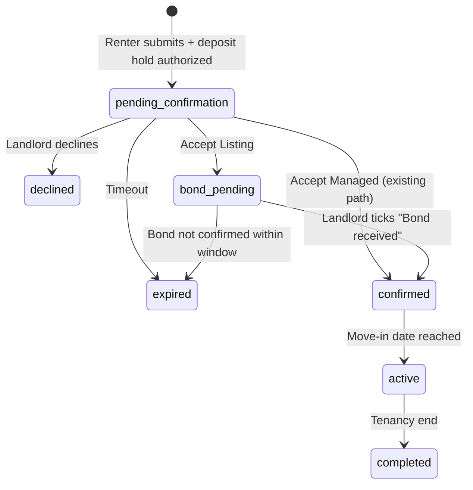

# Phase 3 — Landlord Listing Implementation Design

**Status:** Draft for review · May 2026
**Audience:** Rob (review/approve) → Cursor (implementation)
**Purpose:** Complete the Quni Listing service tier end-to-end so launch can proceed in NSW and VIC, where Managed is gated by legal/licensing constraints. This is not optional polish — it is the launch enabler in any state where Managed is not yet cleared.

---

## 1. Goals & non-goals

### Goals
- Enable Quni Listing as a fully working service tier from booking request through to lease execution
- Gate Managed at the state level so landlords in non-cleared states only see Listing
- Wire the $99 Listing landlord fee charge mechanism
- Replace the misleading auto-set `acknowledged_by_landlord` with a real handshake on Listing
- Add telemetry to observe service tier distribution and conversion

### Non-goals
- Renter-side fee model changes (renters pay zero — locked)
- New payment processors or changes to Stripe Connect setup for Managed
- Pricing/percentage changes
- Phase 4 features (renewals, rent uplift, multi-state Managed expansion)

---

## 2. State × tier availability gating

Landlords in different states see different service tier options at listing creation and booking acceptance.

NSW row disambiguated by tier (T1 vs T2); product/legal sign-off recorded when external opinion received.

| State | Listing | Managed | Notes |
|---|---|---|---|
| QLD | ✓ | ✓ | Rob's Class 1 RE Agent licence — both tiers available |
| NSW — Tier 1 (boarder/lodger) | ✓ | ✓ | RTA does not apply; PSAA characterisation not triggered for this tier |
| NSW — Tier 2 (residential tenancy) | ✓ | ⚠ Gated | PSAA s.3A question pending external legal opinion — gated until resolved |
| VIC | ✓ | ✗ | Managed gated until Victorian property lawyer engagement |
| Other Australian states | ✓ | ✗ | Listing available nationwide (landlord-run tenancy); Managed unsupported until launch-state clearance |

### Mechanism

`resolveServiceTierAvailability()` (already wired into the pricing page) is the single source of truth. Extend its consumers:

- **Landlord listing creation:** if Managed is unavailable in the property's state, hide the option entirely. Property defaults to Listing-only.
- **Booking acceptance UI:** the three-button accept flow renders only tiers available in the property's state. A NSW landlord sees `[Accept Listing] [Decline]`, not the Managed button.
- **Pricing page (already done):** badges/lines per state per tier.

### State change behaviour (when Jenny clears NSW, etc.)

- New properties created after that date can opt for Managed
- Existing properties default to their original tier — landlord can opt-in to Managed via property edit
- No automatic conversion of existing listings

---

## 3. Booking state machine extension

### Existing states (from Stage 1 audit)

`pending`, `pending_payment`, `pending_confirmation`, `awaiting_info`, `confirmed`, `active`, `cancelled`, `declined`, `expired`, `payment_failed`, `completed`

### New columns on `bookings`

| Column | Type | Purpose |
|---|---|---|
| `service_tier_at_request` | enum | Snapshot of the tier offered when the renter applied |
| `service_tier_final` | enum | What was confirmed at landlord acceptance |
| `bond_received_by_landlord_at` | timestamptz | Listing-only handshake; gates lease unlock |

### Transition flow



`bond_pending` can be a new state or a substate of `pending_confirmation` — implementation choice. Recommend new state for cleaner queries.

---

## 4. Confirm API design

### Recommendation: one endpoint, mode-based branching

`POST /api/confirm-booking` with body:
```json
{
  "booking_id": "...",
  "service_tier": "listing" | "managed",
  "actor": "landlord"
}
```

Internal branching:

- `service_tier === 'managed'` → existing `create-rent-subscription.ts` path (capture deposit PI, create rent subscription with `application_fee_percent`)
- `service_tier === 'listing'` → new path:
  - Charge landlord $99 (mechanism in §5)
  - Cancel renter's deposit hold (Quni doesn't custody anything on Listing)
  - Set `service_tier_final = 'listing'`, transition to `bond_pending`
  - Email renter: "Pay bond direct to landlord — landlord will confirm receipt and the lease will unlock"
  - Email landlord: "Confirm bond received to unlock the lease for signing"

### Why one endpoint vs two

Single endpoint centralizes state machine logic, validation, idempotency, and authorization. Two endpoints would duplicate all of that.

### Idempotency

Same idempotency key pattern as `create-rent-subscription`. Double-clicks must not double-charge.

---

## 5. Payment matrix

| Step | Listing | Managed |
|---|---|---|
| Renter submits booking | Deposit PI authorized (held, not captured) | Deposit PI authorized (held, not captured) |
| Landlord accepts | Cancel renter deposit hold + charge landlord $99 | Capture renter deposit PI + create rent subscription |
| Bond payment | Direct landlord ↔ renter (off-platform) | Per open audit (memory line 24) |
| Weekly rent | Direct landlord ↔ renter (off-platform) | Connect subscription with 7% retained |

### Listing $99 charge mechanism — confirmed Option 1

Two options were considered:

1. **Direct platform charge (locked)** — `stripe.charges.create({ customer: landlord.stripe_customer_id, amount: 9900 })`. Simple. Lands in Quni's Stripe account directly. Landlord doesn't need Stripe Connect.
2. **Connect application fee** — landlord pays via their connected Stripe account; Quni takes platform fee. More complex; requires landlord to have Stripe Connect set up before listing.

**Decision: Option 1.** Listing landlords don't need Connect (they receive bond/rent direct from renters). Direct charge keeps landlord onboarding simple — they only need a saved card on file.

### Renter deposit hold release on Listing

When the landlord accepts as Listing, the renter's authorized deposit hold must be released (no capture). Stripe `paymentIntents.cancel` reverts the hold immediately. Test this end-to-end before launch.

---

## 6. Bond handshake semantics

### Current state (per Stage 1 audit)

- `bookings.bond_acknowledged` — renter-only; set true on booking insert; means "renter ticked the T&C checkbox." No conflict with future use.
- `bonds.acknowledged_by_landlord` — auto-set true on `create-rent-subscription` confirm without any real landlord action. **Misleading.**

### Phase 3 changes

- **Stop** auto-setting `acknowledged_by_landlord` on confirm. The field stays in schema but is only set when a landlord actually performs an acknowledgement action.
- **Add** `bookings.bond_received_by_landlord_at` (Listing only) — set when the landlord ticks "Bond received" in their dashboard. Gates Listing lease unlock per the option-2 handshake.
- **Defer** Managed bond row schema decisions until the open audit completes (memory line 24).

### Migration

Existing rows: leave `acknowledged_by_landlord` as-is (it's noise but not actionable). Future confirms simply stop writing to it from the auto-path. If a real Managed bond acknowledgement action is added later, that path writes the field correctly.

### Task H — Bond received action (`POST /api/booking-mark-bond-received`)

Landlord self-report; Quni does not custody bond on Listing tenancies. Implementation follows the Cursor task breakdown; this subsection locks **§2 — Update logic** for that endpoint.

#### §2 — Update logic

**Do not modify `confirmed_at`.** It was set by Task D at the landlord-accept moment and represents the timestamp of landlord commitment, not the moment the booking reaches its “fully confirmed” state. The fact that `confirmed_at` is set while `status` is `bond_pending` is intentional — the column tracks landlord acceptance regardless of subsequent state transitions. (This note is here because it looks like a bug at first glance and isn’t.)

- **a.** Load booking; validate: current user is the landlord on this booking; `service_tier_final === 'listing'`; `status === 'bond_pending'`; if status is already past `bond_pending` (`confirmed`, `active`), return current state idempotently — no error; any other state → structured error.
- **b.** Update booking: `bond_received_by_landlord_at` = now(); `status` = `confirmed` (match Managed post-confirm status).
- **c.** Insert `service_tier_events`: `event_type` e.g. `bond_received_acknowledged`; `service_tier` = `listing`; `booking_id`, `property_id`, `landlord_id`, `student_id`; `metadata` includes `bond_received_at` (server inserts via service role — RLS does not allow landlord JWT inserts).
- **d.** Return updated booking state.

**Transaction / telemetry failure policy:** Prefer an atomic write where Supabase RPC or transaction support allows it (booking update + `service_tier_events` insert in one transaction, matching the pattern in `confirmListing`). If atomic isn’t feasible due to RLS / service-role split, do the booking update first; if the telemetry insert subsequently fails, log a warning but do **not** roll back the booking update. Booking state is the source of truth for users; telemetry is observational. A landlord’s bond-received action should not be rejected because an analytics insert failed.

---

## 7. Rollout & feature flagging

### Pre-launch
- Build behind `platform_config.phase_3_enabled` flag (default: false)
- Internal testing with Rob's own listings in QLD (Managed available) and NSW (Listing only — validates the gate)

### Launch sequence
1. Enable in QLD first — most thorough test, both tiers active
2. Enable in NSW — Listing only, validates state-availability gating works
3. Enable in VIC — same as NSW

### Feature flag scope
Single boolean to enable Phase 3 across all states is fine — state-level availability is enforced by `resolveServiceTierAvailability()`, not by separate flags per state.

---

## 8. Telemetry

New table:

```sql
CREATE TABLE service_tier_events (
  id uuid PRIMARY KEY DEFAULT gen_random_uuid(),
  event_name text NOT NULL,
  booking_id uuid REFERENCES bookings(id),
  property_id uuid REFERENCES properties(id),
  from_tier service_tier_enum,
  to_tier service_tier_enum,
  actor_role text,
  occurred_at timestamptz DEFAULT now(),
  metadata jsonb
);
```

Events to emit:

- `booking.service_tier_offered` — on booking request, snapshot of available tiers
- `booking.service_tier_accepted` — on confirm, with `from_tier`/`to_tier` if landlord accepts a different tier than offered
- `booking.service_tier_declined`
- `listing_fee.charged` / `listing_fee.failed`
- `bond_received_by_landlord` — Listing only

---

## 9. Open dependencies

### Managed deposit + bond flow audit (memory line 24)

Required before Managed-side confirm path can be validated. **Not a blocker for Listing-side Phase 3 work** — the Listing flow is independent of how Managed handles deposit/bond internally. Run the audit in parallel.

### Stripe Connect Express verification for Listing

Confirm that Listing landlords can be charged the $99 platform fee without needing Stripe Connect setup. This may already work via direct customer charge; verify before building.

---

## Implementation order (suggested for Cursor task breakdown)

1. **State × tier availability gating** in landlord listing creation flow
2. **`bookings` schema additions** (`service_tier_at_request`, `service_tier_final`, `bond_received_by_landlord_at`)
3. **Confirm API mode branching** with stub Listing path
4. **Listing $99 charge wiring** + Stripe behaviour verification
5. **Three-button accept UI** + state-aware rendering
6. **`bond_received_by_landlord` action** + lease unlock gate
7. **Email flows** (renter "pay bond direct", landlord "confirm bond received")
8. **Telemetry events table** + emit from confirm paths
9. **`acknowledged_by_landlord` auto-set unwind**
10. **End-to-end tests** for Listing booking flow

---

## Decisions (locked)

1. **Listing $99 charge mechanism** — Option 1 (direct platform charge). Listing landlords need a saved card on file, not Stripe Connect setup.
2. **Bond confirmation timeout** — Defer to relevant state tenancy legislation. Where state law is silent on booking-window timing, fallback to **7 days** from acceptance as platform policy. Final per-state defaults to be confirmed by Jenny before launch in each state.
3. **No-bond-paid handling** — Landlord can cancel the booking via their dashboard at any point in `bond_pending`. Cancellation rights and refund treatment of the $99 are to be guided by the relevant state tenancy legislation and the tenancy agreement template; default until confirmed: $99 fully refunded to landlord (no-fault outcome) and the listing slot reopens. Confirm wording with Jenny.
4. **Three-button accept default** — When both tiers are available (currently QLD only), **Managed is the default** with a "Most popular" tag (or similar pattern from the existing pricing page). In states where only Listing is available, no choice is presented — the landlord sees a single-button accept.
5. **Phase 3 vs iOS sequencing** — Phase 3 first, no urgency on iOS. Goal is platform live, not multi-platform parity at launch.

### State legislation notes (for Jenny review before each state launch)

| State | Bond lodgement deadline (landlord obligation) | Booking confirmation window |
|---|---|---|
| NSW | Per s.159 RTA 2010 (RBO via NSW Fair Trading) | Not directly mandated — platform default 7 days, reflected in Quni Platform Addendum |
| QLD | Per RTA QLD (RTBA equivalent — RTA bond lodgement) | Not directly mandated — platform default 7 days |
| VIC | Per RTA 1997 (RTBA lodgement) | Not directly mandated — platform default 7 days |

Bond lodgement deadlines are landlord-side obligations under state law. Quni's role on Listing is to surface these obligations clearly in the tenancy agreement and dashboard reminders — not to enforce them.

The 7-day platform timeout is for Quni's booking state machine (when `bond_pending` should auto-expire if the landlord hasn't ticked "Bond received"). It is independent of the lodgement deadline once bond is paid.

---

*End of design doc. Decisions locked. Ready for Cursor to break into the implementation order at §10. Open audit on Managed deposit + bond flow runs in parallel.*
