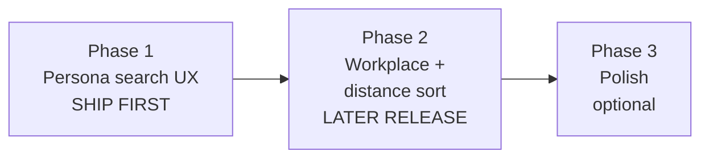

# Professional / workplace location search — scope

**Status:** Phase 1 (R1) **implemented** · Phase 2 **scoped**, build after R1 ships and early professional usage informs details  
**Context:** Hero and strategy copy promise *“near your university or workplace”*, but search/onboarding remain campus-first. Non-students (`accommodation_verification_route = 'non_student'`) have no workplace anchor and cannot sort by distance to work.  
**Related:** [dual-tier-service-model.md](./dual-tier-service-model.md) (persona expansion), prior decision in hero thread: messaging updated first, search UX deferred.

---

## Locked product decisions (2026-05-26)

| # | Decision | Rationale |
|---|----------|-----------|
| 1 | **Workplace saved on profile only** — not onboarding step 1 | Signup friction; many professionals want to browse before committing. Optional profile field + contextual UI nudge, not a blocking onboarding step. |
| 2 | **University/campus filters hidden for professionals** | Professionals don’t have a university; campus dropdowns feel off-brand. **Edge case:** UNSW staff (etc.) set **UNSW as their workplace address** in Phase 2 — not via campus filters. |
| 3 | **Default search radius 15 km**; UI options **5 / 10 / 15 / 25 km** | Fits Sydney sprawl: 5 km too tight, 25 km too broad. |
| 4 | **Guests: one-off “near address” without login — yes, URL only** | Lowers hero → first-listing friction; nothing persisted; no privacy issue. Pre-signup taste of distance search. *(Phase 2 — requires geocode + `near_*` URL params.)* |
| 5 | **Release: Phase 1 standalone, then Phase 2 later** | Phase 1 ~1 day = quick credibility fix. Phase 2 ~4–6 days = separate release once real professional signups inform spec, not guesswork. |

**Still locked from draft (not re-litigated)**

| Topic | Decision |
|-------|----------|
| Landlord applicant views | Workplace fields **not** shown to landlords in Phase 2 (search-private). |
| Suburb-only workplace save | **Yes** — suburb + state + postcode minimum; street optional; centroid geocode with “approximate area” copy. |
| Distance type | Straight-line km only; never driving/transit time in copy. |

---

## 1. Goals

| Goal | Measure |
|------|---------|
| Professionals can find rooms **near where they work** without pretending to pick a university | Non-student can search/sort without required uni/campus |
| Copy and product align | No “workplace” promise without a real input (Phase 2 completes this; Phase 1 removes contradiction in search chrome) |
| Reuse existing infra | `/api/geocode`, `properties.latitude/longitude`, Haversine RPC pattern |
| Stay student-led at launch | Students keep current search; professionals get additive UX |
| Honest distances | Straight-line km only unless we later buy routing APIs |

**Non-goals (this initiative)**

- Driving/transit commute times (Google Directions, Mapbox Isochrone)
- Workplace shown on landlord applicant cards (unless explicitly added later)
- Replacing campus SEO pages or university-first acquisition
- Third renter persona in DB (`graduate` etc.) — still `student` vs `non_student`

---

## 2. Release sequencing



| Release | Scope | When |
|---------|--------|------|
| **R1 — Phase 1 only** | Persona-aware labels; hide uni/campus for professionals; suburb-first browse | **Next build** (~1 day dev) |
| **R2 — Phase 2** | Profile work location, geocode, `properties_near_point`, distance sort, guest URL `near_*` | **After R1 + early professional feedback** |
| **R3 — Phase 3** | Autocomplete, defaults, map, etc. | Post-launch, pick items |

**Do not bundle Phase 1 and Phase 2** in one release unless explicitly re-scoped.

---

## 3. Phase 1 — Persona-aware search (R1)

**~1 day** · No new DB · No geocode

### Behaviour

| Surface | Student / guest | Professional (logged in, `non_student` route) |
|---------|-----------------|-----------------------------------------------|
| Home hero search label | “Suburb or university…” | “Suburb or area near work…” |
| Home uni + campus dropdowns | Shown | **Hidden** (not collapsed optional) |
| Listings sidebar search placeholder | “Suburb or keyword…” | “Suburb or area…” |
| Listings uni + campus filters | Shown | **Hidden** |
| Onboarding step 1 | Unchanged (no workplace fields, no work-location CTA) | Unchanged — browse-first; workplace is Phase 2 profile |

### Implementation notes

- Persona: `isNonStudentAccommodationRoute(profile.accommodation_verification_route)`.
- **Guests:** keep **student-style** search (uni/campus visible) — guest one-off near-address is **Phase 2**.
- **No** geocode, migration, or URL `near_*` params in Phase 1.

### Phase 1 acceptance

- [x] Logged-in professional never *must* select a university to browse.
- [x] Professional does not see university/campus filter controls on Home or Listings.
- [x] Student and guest flows unchanged vs today.
- [x] Hero/subhead no longer contradicted by forced campus UI for professionals.

### Phase 1 — explicitly out of scope

- Saving workplace on profile  
- Distance sort / `near_lat` URL params  
- Guest address search without login  
- Onboarding copy about work location (nudge deferred to Phase 2 listings/profile)

---

## 4. Phase 2 — Workplace anchor + distance search (R2)

**~4–6 days** · Separate release after Phase 1

*Refine UI copy and nudge placement using feedback from R1 professional signups.*

### 4.1 Data model (`student_profiles`)

| Column | Type | Notes |
|--------|------|--------|
| `workplace_label` | `text` null | Optional, e.g. “Martin Place office” |
| `workplace_address` | `text` null | Street line; optional if suburb-only |
| `workplace_suburb` | `text` null | Required when saving a workplace |
| `workplace_state` | `text` null | AU state |
| `workplace_postcode` | `text` null | |
| `workplace_latitude` | `double precision` null | Set after geocode |
| `workplace_longitude` | `double precision` null | |
| `workplace_geocoded_at` | `timestamptz` null | Refresh when address edits |

**Where users set it:** **Profile only** (dedicated “Work location” section). Optional; never required to finish onboarding.

**Contextual nudge (not onboarding):** e.g. on Listings for professionals without saved workplace — *“Set your work location to see nearby listings”* → Profile (or inline modal that writes to profile).

**UNSW / uni staff edge case:** User enters workplace as **UNSW Kensington** (address), not campus filter. Distance anchor = geocoded workplace.

**Privacy / RLS:** Tenant read/update own row only. **Do not** add workplace fields to landlord booking review / applicant modals in R2.

### 4.2 Geocoding

- Reuse `GET /api/geocode?q=…` + `buildGeocodeQueryCandidates` / `streetLineForGeocode`.
- Minimum **suburb + state + postcode**; street optional.
- Copy: *“Approximate distance — straight line, not driving time.”* Suburb-only → *“Approximate area”* where relevant.

### 4.3 Database RPC

```sql
-- properties_near_point(origin_lat, origin_lon, radius_km default 15)
-- Same Haversine as properties_near_campus; grant anon + authenticated.
```

Keep `properties_near_campus` for SEO — no breaking change.

**Radius:** default **15 km**; filter UI **5 / 10 / 15 / 25 km**.

### 4.4 Listings query

**URL params (shareable, including guests)**

| Param | Example | Meaning |
|-------|---------|---------|
| `near_lat` | `-33.8688` | Anchor |
| `near_lon` | `151.2093` | |
| `near_radius` | `15` | km; default **15** if omitted |
| `sort` | `distance` | Sort by distance |

**Guests:** may land on `/listings?near_lat=…&near_lon=…` from hero — **URL only**, nothing saved to DB or localStorage (session navigation only; optional `sessionStorage` for same-tab convenience is OK if clearly non-persistent).

**Logged-in professionals**

- One-off address search → `near_*` in URL (same as guests).
- Saved profile workplace → “Use my work location” → populate URL from profile lat/lng.

Flow when `near_lat` + `near_lon` set:

1. `rpc('properties_near_point', …)` → `{ id, distance_km }[]`
2. Intersect with existing filters + RLS-visible properties.
3. `sort=distance` uses RPC order; listings without coords excluded from distance results.
4. `PropertyCard`: optional badge *“~X km from your work”* (or *“from this location”* for guests).

### 4.5 Surfaces to touch (R2)

| Area | Change |
|------|--------|
| Migration + `properties_near_point` | SQL |
| `StudentProfile.tsx` | Work location section (profile only) |
| `Home.tsx` | Address/suburb → geocode → navigate with `near_*` (professionals + guests) |
| `useListingsFilters.ts` / `useListingsQuery.ts` | `near_*`, `sort=distance` |
| `Listings.tsx` | Radius selector 5/10/15/25; distance sort; active “near work” chip; contextual nudge |
| `PropertyCard.tsx` / `PropertyDetail.tsx` | Distance from anchor when present |

### 4.6 Listing coverage

Distance sort requires property `latitude` / `longitude`. Plan optional backfill (~0.5–1 d) if coverage is low at R2 launch.

### Phase 2 acceptance

- [ ] Professional saves work location on **profile** (optional); can sort by distance from it.
- [ ] Professional and **guest** can one-off search by address → shareable URL with `near_*`.
- [ ] Default radius 15 km; UI offers 5/10/15/25.
- [ ] Uni/campus filters remain hidden for professionals (from Phase 1).
- [ ] Students unchanged when no `near_*` params.
- [ ] Landlord views do not show workplace fields.
- [ ] Straight-line distance copy everywhere.

---

## 5. Phase 3 — Polish (optional)

**~3–5 days** · After R2

- Address autocomplete (Google Places / Mapbox)
- Default `sort=distance` for professionals when profile has coords
- AI chat workplace context (guarded)
- Saved-search / email alerts by radius
- Map on listings (suburb-safe)
- Signup card label “Professional” (UI; DB stays `non_student`)

---

## 6. User stories

| # | As a… | I want to… | So that… | Release |
|---|--------|------------|----------|---------|
| 1 | Professional | Browse and filter by suburb without university/campus UI | I’m not on a student-only product | **R1** |
| 2 | Professional | Optionally save work location on my profile | Repeat searches are easy | **R2** |
| 3 | Professional | Sort listings nearest my work (15 km default) | I find a reasonable commute area | **R2** |
| 4 | Professional / guest | Search once by address without an account | I can try the product before signup | **R2** |
| 5 | UNSW staff (pro) | Set “UNSW Kensington” as my workplace | Distance works without campus filters | **R2** |
| 6 | Student | Keep university/campus filters | My flow stays familiar | **R1** |
| 7 | Guest (R1) | Suburb + uni search as today | No regression before R2 | **R1** |

---

## 7. Technical dependencies

| Asset | Status | Needed for |
|-------|--------|------------|
| `isNonStudentAccommodationRoute` | ✅ | R1 |
| `GET /api/geocode` | ✅ | R2 |
| `properties_near_campus` pattern | ✅ | R2 → `properties_near_point` |
| Property lat/lng | ✅ (coverage varies) | R2 |
| RLS `open_to_non_students` | ✅ | R1–R2 |

---

## 8. Effort summary

| Release | Dev (est.) | QA | Notes |
|---------|------------|-----|-------|
| **R1 — Phase 1** | 0.5–1 d | 0.5 d | **Shipped** (`useRenterSearchPersona`, Home, Listings) |
| **R2 — Phase 2** | 4–6 d | 1–2 d | After R1 + feedback |
| Phase 3 | 3–5 d | 1 d | Optional |

R2 may add **0.5–1 d** for listing coordinate backfill if needed.

---

## 9. Risks

| Risk | Mitigation |
|------|------------|
| Phase 1 ships without distance → hero still says “workplace” | Acceptable short term; R2 delivers the input. Phase 1 removes the worst contradiction (campus-only UI). |
| Low property lat/lng coverage | Backfill before or during R2; coverage banner |
| Geocoder failures | `buildGeocodeQueryCandidates` |
| “Commute” overclaim | Straight-line copy only |
| RLS limits professional catalogue | Existing listings banner; distance within visible set |

---

## 10. Build order

### R1 (Phase 1 only)

1. Shared helper: `useRenterSearchPersona()` or equivalent (professional vs student vs guest).
2. `Home.tsx` — conditional labels + hide `UniversityCampusSelect` for professionals.
3. `Listings.tsx` — hide uni/campus filters for professionals; update placeholders.
4. Smoke-test student, guest, professional logged-in paths.

### R2 (Phase 2 — later)

1. Migration + `properties_near_point`  
2. Profile work location + geocode  
3. `near_*` URL contract + listings query pipeline  
4. Home guest/pro address → listings with `near_*`  
5. Distance badges + radius UI + nudge  
6. Optional coordinate backfill  

---

## 11. What we are not doing

**Phase 1:** workplace save, geocode, distance sort, guest `near_*` URLs.

**Phase 2:** driving time, workplace on landlord views, campus filter for professionals, SEO URL changes.

---

## 12. Implementation approval

| Item | Status |
|------|--------|
| Phase 1 standalone (R1) | **Approved** |
| Phase 2 (R2) after feedback | **Scoped, not started** |
| Locked decisions § top | **Confirmed 2026-05-26** |
| Workplace on profile only | **Locked** |
| Uni filters hidden for professionals | **Locked** |
| Radius default 15 km (5/10/15/25 UI) | **Locked** |
| Guest one-off near address, URL only | **Locked (R2)** |
| Workplace off landlord applicant views | **Locked (R2)** |

---

*Last updated: 2026-05-26 (decisions locked)*
