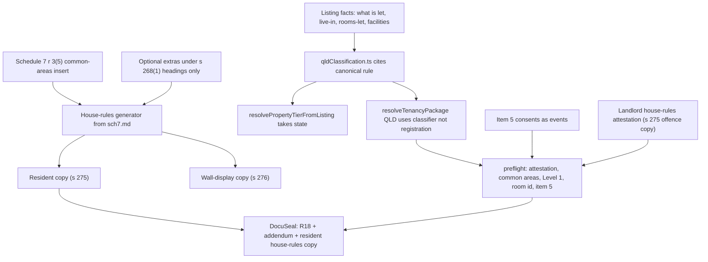

# QLD rooming ungate plan

**Status:** Stage 1 is on Production. Stages 2, 4 and 6 are not approved. Stage 3's revised generator scope is accepted and **can ship immediately after Stage 1, before Stage 2.** Not approved to build until Rob says go. Revised 5 Sep 2026 night: reorder, delivery surface, LSA v1.1 2.2 instruction withdrawn.
**Canonical rule:** [`docs/legal/qld-classification-rule.md`](legal/qld-classification-rule.md). Do not restate the test here.
**What the router does today:** [`docs/qld-rooming-accommodation-audit.md`](qld-rooming-accommodation-audit.md).
**Contradiction inventory:** [`docs/qld-rule-reconciliation.md`](qld-rule-reconciliation.md).

No product code in this document except Stage 1, which has shipped. Preview-or-flag still applies to every user-visible cut. Production only after Rob says go.

---

## Definition of done

Quang Dinh lists a room at Jamboree Heights (QLD, landlord off site, two rooms let individually, shared kitchen and bathrooms, Level 1, no food, no personal care). He accepts an applicant. Both parties sign:

- A filled Form R18 (v15 Sep25 or the then-current RTA form)
- Item 3 (Manager/provider's agent) blank. Never Quni. Quni never signs.
- Item 5 filled from consents each party actually chose, not from a hardcoded email-Yes
- Item 13.2 filled when the landlord knows the last increase date for the room, blank if not previously increased
- Item 17 Yes, driven off a landlord attestation given before signature that he has given the house rules to the resident. The generator refuses to run without that attestation because entering the agreement without giving the rules is an offence (s 275, 10 penalty units), not only a breach of a standard term
- Generated house rules in the pack: Schedule 7 locked text with the common-areas insert completed, plus any provider rules written under the s 268(1) headings. Resident copy appended to DocuSeal. Wall-display copy for the landlord to put up (s 276)

Nothing wrong is produced. Form R1, R9, R12 and R13 stay with the landlord and the RTA's free forms, the same way Form 1a and Form 9 stay with a QLD general-tenancy landlord today. Quang with a bond lodges it (Form 2 copy we already give) and completes his own R1.

---

## Scoping line

Ungated means nothing wrong is produced, not that everything is built. Anything the landlord needs at signature is in scope. Anything he needs weeks or months later is out, because the RTA publishes those forms free and he uses them directly.

**In at signature:**

- State-aware resolution
- Form inputs the canonical rule needs
- Item 5 notice-consent capture (data). The notice *service* layer stays out
- Item 11: at least two nominated payment methods **and** the direct-credit block (bank, BSB, account name, account number, payment reference). Section 98 and the form are "and", not "or"
- Item 13.2 optional date: last rent increase for the room. Blank means not previously increased. Not a ledger
- Landlord house-rules attestation (Item 17). Gate copy names the s 275 offence
- House-rules generator from [`docs/legal/qld-prescribed-house-rules-sch7.md`](legal/qld-prescribed-house-rules-sch7.md). Do not re-derive Schedule 7 or ss 266 to 276 from RTA fact sheets
- Two house-rules outputs: resident copy (s 275) and wall-display copy (s 276)
- R18 generator
- DocuSeal package: R18 + rooming Quni addendum + generated resident house-rules copy
- Rooming variant of the Quni addendum
- 2-week rent-in-advance cap
- Existing Form 2 / RTA lodgement copy
- Landlord Service Agreement v1.1, in this release or not at all

**Out of this ungate, and stays out:**

- Form R1 generator. Follow-on brief, with R9, R12 and R13.
- R9 / R12 / R13 notice engine and clocks. Item 5 *data* is in. Serving notices, deemed receipt, and withdrawal-as-a-product-flow are not.
- Premises-level house-rules object, versioning, immutable issued versions, 7-day change notice (s 270), objection and tribunal path (ss 271 to 274). Follow-on. A wall-display PDF at signature is in (s 276). Changing rules after residents are in is out.
- Free-text "add your own rules" and optional upload of an adapted PDF. Both invite a s 268(4) offence. Provider extras are structured by the seven s 268(1) subjects only.
- A room-level rent-increase **ledger**. Item 13.2 is a single optional date on the listing.
- General-tenancy opt-in election (known path; Quni does not offer it).
- VIC rooming.
- Any national T1/T2/T3 redesign beyond giving `resolvePropertyTierFromListing` `state` and mapping QLD from the classifier.
- RSAA 2002 accreditation.
- Level 2 / Level 3.
- On-campus uni/college product.
- Querying prod for existing QLD off-site room listings or signed 18as. There are none. No QLD tenants have been signed up. No void / re-paper / case-by-case line.

**Do not hang R18 off registration.** QLD routing must not read `is_registered_rooming_house`. The registered-rooming card must not be the QLD trigger. Acceptance test: QLD off-site room with the flag true and with the flag false both classify as rooming. Quang (flag false) is the path that must generate R18.

---

## Locked: T3 as output, never as input

Classifier outcomes for QLD: `general_tenancy` (18a) / `rooming` (R18) / `outside_act` (occupancy). Pricing still uses `t1`/`t2`/`t3` as **outputs** of that mapping. QLD rooming → `t3` so the fee matrix has a row. That is not using the T3 **flag**. NSW keeps today's registration trigger. VIC keeps today's table until its own brief.

Root cause: [`src/lib/pricing/index.ts`](../src/lib/pricing/index.ts) `resolvePropertyTierFromListing(propertyType, isRegisteredRoomingHouse)` has no `state`. Callers that already have state must pass it: [`LandlordPropertyFormPage.tsx`](../src/pages/landlord/LandlordPropertyFormPage.tsx), [`landlordAcceptTierOptions.ts`](../src/lib/landlordAcceptTierOptions.ts), [`Booking.tsx`](../src/pages/Booking.tsx), [`api/lib/booking/serviceTierSnapshot.js`](../api/lib/booking/serviceTierSnapshot.js). Do not add a QLD `if` inside a still-stateless function.

---

## Locked: `property_group_id` is not a legal entity

`property_group_id` groups duplicates for the landlord UI. It is not a legal entity. Independent second listings at the same address can miss the group. Quang's two rooms are exactly that shape.

v1 does not try to share a premises object across them. Each listing carries its own house-rules attestation, common-areas insert, and optional s 268(1) extras. Two rooms, two generated packs, one landlord. He can type the same common-areas description twice. We do not join them.

---

## Architecture (target)

During Stages 1 to 5 the router classifies QLD rooming correctly and returns `supported: false`. Listing save and publish are allowed. Accept is not. Stage 6 registers `qld-form-r18` and accept proceeds.

---

## Item 17 and the addendum, settled on the instrument

**Item 17.** Form R18 standard terms clause 18(2) places the obligation to give the house rules on the **provider**, before entering into the agreement. s 275 makes entering the agreement without having given a copy an **offence** (10 penalty units). Item 17 is the provider's statement that he discharged that obligation. Quni is not a party and does not sign. Item 17 is truthfully Yes when the landlord attests before signature that he has given the resident the generated house rules. The generator refuses to run without that attestation. Gate copy says that in those terms: we are stopping him committing an offence, not ticking a form box.

**Addendum.** Form R18 standard terms clauses 2(4) to 2(6): the parties may agree special terms; a duty or entitlement under the Act overrides any term inconsistent with it; a standard term overrides an inconsistent special term. The Quni rooming addendum is subordinate special terms. That is stated on the instrument. The addendum must not tell the parties to use Form 9, Form 1a, or Form 14a. On this path those are R9 and R1, which the landlord downloads from the RTA when he needs them.

**House rules in the pack.** Clause 2(3) makes house rules terms of the agreement. The generated resident copy is appended so the resident signs a pack that contains those terms. The wall-display copy is for s 276. Quni generates from the Schedule 7 source file plus the landlord's common-areas insert and any extras under the s 268(1) headings. Quni does not author extra subjects, does not version a premises object, and does not run the s 270 to 274 change process.

Do not route these points to counsel. Cite the form and the Act.

---

## Item 5, settled on the form

Form R18 item 5 is a notice consent matrix: four parties (provider, resident, provider's agent, resident's representative) by three channels (email, text message, facsimile), each with yes/no and its own address.

Clause 36(3)(c) makes electronic service valid only if there is an electronic address in items 1 to 4 **and** item 5 permits that specific channel. Clause 36(5) allows address change only by notice to each other relevant party. Clause 36(7) allows withdrawal of consent only the same way. Clause 36(8) sets deemed receipt per channel, email when it enters the recipient's server.

Capture is in Stage 2. Fill is in Stage 4. The notice service layer stays out of v1.

Do not hardcode it the way Form 18a hardcodes email Yes in [`officialQldForm18aFill.ts`](../api/lib/documents/officialQldForm18aFill.ts). That sets service consents on the landlord's and the resident's behalf that neither chose, and withdrawal later requires formal notice between them.

Store it shaped for the later service layer: per party, per channel, per address, with change and withdrawal as **events** rather than as overwrites. Current consents are a projection. Getting the shape wrong now costs twice.

Item 3 is blank, so the provider's-agent party is empty (no addresses, consents No). Resident's representative is optional and defaults empty. The schema still has all four parties.

Provider consents are collected on the listing. Resident consents are collected on apply. The generator reads the projection. It does not invent Yes.

---

## Four open form decisions (Rob)

Decided that they are open. Not decided what the answers are. Stage 2 starts 4 to 6 days after Stage 1 is approved and does not wait. Cost if the answer lands after Stage 2 has started:

1. **Shared-facilities vs self-contained on the room card.** Likely yes. **QLD listings only.** VIC rooming is occupancy capacity (not less than 4) plus council registration, not shared facilities. NSW turns on exclusive possession and landlord control; an off-site landlord letting a room under a written agreement gets FT6600, the same form a self-contained studio would get. Queensland is the only one of the three where sharing a kitchen or bathroom decides which prescribed form is produced. Do not show the question on NSW or VIC. Do not back-ask live NSW or VIC studio listings.

   If "yes" after Stage 2 has already treated every QLD off-site room as rooming: add the QLD-only field, back-ask live **QLD** room-card studios, restamp QLD classifier tests. About 1 to 2 extra engineer-days, and do not ungate QLD room-card `studio` until it lands. If "no": Stage 2 is already correct; cost is zero. If it lands after ungate as "yes", that is the studio hole: a self-contained unit on the QLD room card can get R18 when the rule says 18a. Entire-place studio card already maps to general tenancy and stays 18a.
2. **Live-in managing agent.** Stage 2 starts on the support-path default. Item 3 stays blank. If Rob later wants it collected: a listing field plus a classifier input (owner off site, agent on site may be the live-in branch). About 3 to 5 extra engineer-days, and it is not on Quang's path. If it stays support-only after Stage 2: cost is zero.
3. **Rooms-let helper wording** ("bedrooms"; silent on whether the provider's own room counts). Live-in s 43 only. Quang is off-site and does not need the count. A late wording fix is copy, not a router change, if Stage 1 already gates on-site 4+ as rooming. Hours, not days. Not on the critical path.
4. **On-campus exclusion.** Lean: do not collect. `campus_id` is not that test. If Rob later wants it: one listing question and one classifier input. About 1 to 2 extra engineer-days. Cost of not collecting: a uni or NFP college inside campus boundaries could theoretically get R18. Quni's marketplace is off-campus. Accept that.

Highest late-land cost is still (1), and only if we ungate QLD room-card studios without it. It is a QLD form-and-classifier add, not an all-states migration.

---

## Stages

### Stage 1. State-aware resolution. Stop issuing 18a at accept, not at listing

**Approved to build.**

**DoD:**

- QLD off-site room and shared bedroom no longer resolve to `qld-form18a`.
- Classifier tests match the canonical table.
- `resolveTenancyPackage` QLD cases match the classifier.
- `resolvePropertyTierFromListing` requires `state`.
- QLD routing does not read `is_registered_rooming_house`. Acceptance test: QLD off-site room with the flag true and with the flag false both classify as rooming.
- QLD rooming maps to `t3` as an output. [`qldServiceTierAvailability`](../api/lib/serviceTier/qld.ts) for that output: **Listing available, Managed unsupported.** That is what lets the Brisbane funnel keep listing. Today's `t3` row ("unsupported because registered rooming") must not remain the save blocker.
- The package is `supported: false` until Stage 6. Generator id is not registered. `confirmListing` already runs preflight **before** the $99 charge; that fail-closed path is the legal gate.
- Entire-place QLD stays 18a and remains acceptable.
- On-site ≤3 stays occupancy and remains acceptable.
- On-site 4+ classifies as rooming, same accept gate, and is not told to use the registered-rooming card.
- Admin `qld-t2` intent no longer means "off-site room = 18a."

**What the landlord sees at the accept gate**

The listing is live. Applicants can apply and sit verified. On booking review, Accept as Quni Listing is visible as the product they listed under, but it is disabled (or a click opens the same copy and does not call confirm). Copy, in substance:

- This arrangement is rooming accommodation under the RTRA Act.
- The prescribed form is Form R18.
- Quni does not generate Form R18 yet. You cannot accept this applicant until that form is available.
- Do not sign a Form 18a for this listing. Quni will not produce one.
- Keep the applicant. You will be able to accept them on this booking when Form R18 ships.

The confirm API still returns `agreement_preflight_failed` with that reason if anything bypasses the button. No charge. No DocuSeal. No 18a.

**Unblocks:** Safe build window without killing the Brisbane listing funnel. Quang cannot be papered with 18a.

**Key files:** [`api/lib/tenancy/qldClassification.ts`](../api/lib/tenancy/qldClassification.ts) (new), [`api/lib/resolveTenancyPackage.ts`](../api/lib/resolveTenancyPackage.ts), [`api/lib/resolveTenancyPackage.test.ts`](../api/lib/resolveTenancyPackage.test.ts), [`src/lib/pricing/index.ts`](../src/lib/pricing/index.ts), [`api/lib/serviceTier/qld.ts`](../api/lib/serviceTier/qld.ts), [`src/lib/landlordAcceptTierOptions.ts`](../src/lib/landlordAcceptTierOptions.ts), [`src/pages/landlord/LandlordBookingReviewPage.tsx`](../src/pages/landlord/LandlordBookingReviewPage.tsx), [`src/lib/tenancy/qldBoarderLodger.ts`](../src/lib/tenancy/qldBoarderLodger.ts), [`src/lib/landlordAccommodationChoice.ts`](../src/lib/landlordAccommodationChoice.ts), [`api/lib/tenancy/jurisdictionCopy.ts`](../api/lib/tenancy/jurisdictionCopy.ts).

**Estimate:** 5 engineer-days. User-visible. Ship on its own. Preview, then Production if Rob says go.

### Stage 2. Form inputs the rule and the signature need

Not approved. Starts after Stage 3, not after Stage 1. Does not wait on the four form decisions.

**DoD:** A QLD rooming listing can persist without the registered card, and the row is complete enough for later preflight:

- Room identity (`room_description` live for QLD, not NSW-T3-only)
- Level 1 locked; Level 2 and Level 3 blocked
- Student-accommodation tick (particulars, not a routing input)
- Shared-facilities question on QLD listings only, and only if decision 1 has landed as yes by then; otherwise treat the QLD room card as shared facilities. NSW and VIC room cards are unchanged.
- Rooms-let helper wording only if decision 3 has landed
- Persons in the room and at the premises
- Utilities without "Form 18a Items 13-15" labels
- Item 11: at least two nominated payment methods **and** the direct-credit block (bank, BSB, account name, account number, payment reference). Not either/or
- Item 13.2: optional date, last rent increase for this room. Blank means not previously increased
- Item 5: event-shaped store (per party, per channel, per address; grant / change / withdraw as events). Provider matrix on the listing. Resident matrix on apply. Agent and representative rows exist and stay empty while Item 3 / Item 4 are blank. Projection is what Stage 4 fills. No 18a-style hardcoded email Yes
- Rent treated as accommodation-only at Level 1

Listing save and publish stay allowed (Stage 1). Accept stays gated until Stage 6.

**Unblocks:** R18 fill. Does not ungate.

**Estimate:** 10 engineer-days. The jump from 6 is Item 5: schema plus listing UI plus apply UI, stored as events. Item 11 "and" and Item 13.2 are small inside that number.

### Stage 3 prerequisite. Read the prescribed house rules schedule

**Done.** [`docs/legal/qld-prescribed-house-rules-sch7.md`](legal/qld-prescribed-house-rules-sch7.md) holds Schedule 7 verbatim plus Act ss 266 to 276, read from legislation.qld.gov.au, not from a fact sheet. That file is the source. Do not re-derive any of this from RTA summaries.

**Estimate:** 1 engineer-day (spent).

### Stage 3. House-rules generator, two outputs

Not approved. This is the whole of Stage 3. There is no 3b. It is not a static download. It does not wait on Stage 2.

Source: [`docs/legal/qld-prescribed-house-rules-sch7.md`](legal/qld-prescribed-house-rules-sch7.md) only.

**Why it can precede Stage 2.** The PDF body needs a common-areas description (Sch 7 r 3(5)) and optional extras under the seven s 268(1) headings. That is not Item 5, Item 11, Item 13.2, room identity, persons, utilities relabel, or the Level 1 lock. Those are R18 listing fields. The generator does not read them.

It needs the Stage 1 classifier only as a **gate**: show this for QLD rooming, not for entire-place 18a and not for on-site ≤3 occupancy. It does not need a new classifier input. The known studio/self-contained hole (open decision 1) is the same hole R18 has; shipping Stage 3 first does not create it.

It does not reuse the listing form's existing House rules section (`house_rules` free text plus `property_house_rules` yes/no/approval chips). Those are marketing flags for every state. Schedule 7 must land in new fields. Do not write the generated instrument into `properties.house_rules`. For QLD rooming listings, the structured editor sits in that section and the free-text box is not the legal document.

**Attestation is not in the early ship.** Item 17 attestation and "refuse to generate R18 without it" need a signing path. That path does not exist until Stage 4. Collecting "I have given the rules" on a listing with no resident is the wrong moment. Early Stage 3 is generate and download. Attestation moves to Stage 4 (1 engineer-day). Gate copy when it lands still names the s 275 offence.

**DoD (early ship):**

- Prescribed rules are locked text from Schedule 7. Golden tests match the source file. Do not paraphrase.
- Schedule 7 rule 3(5) is an input. Generation refuses if that insert is blank.
- Provider extras are a closed list. Seven s 268(1) subjects only. No open "add your own rules" box.
- Two outputs from the same content: resident copy (s 275) and wall-display copy (s 276). Tell the landlord the wall copy is for display, not a nice-to-have.
- Carve-outs survive: Sch 7 r 7(2) working dog; Sch 7 r 3(2) cleaning subject to agreement. Do not generate a rule assigning common-area cleaning to all residents.
- Still not a premises object. No versioning, no s 270 to 274 clocks.
- Persist on a QLD rooming listing when one exists, so Stage 4 can append the resident copy later.

Out of this stage: optional PDF upload, free-text extras, change-of-rules product, Item 17 attestation (Stage 4).

**Delivery surface (accept is gated until Stage 6):**

- **With a listing:** the listing House rules section when Stage 1 says QLD rooming. Download both PDFs on a live or draft listing. Not on booking review, not on accept.
- **Without a listing:** a public generator page, no account. Same renderer. Common-areas insert, seven headings, optional premises line for the PDF header. No property row. No save. Disclaimer: not legal advice, Quni is not the agent, prescribed rules apply whether or not they use this. Rate-limit the POST. Preview-or-flag; 302 until Rob says go.

The public page is the cold-DM surface. An account wall in front of the only thing we can offer Brisbane landlords who are not on Quni yet would kill the standalone value. It is worth the extra days. Optional "save to my listing" later is out.

**Unblocks:** Compliant copies in the landlord's hand now, including people signing a paper R18 from the RTA. Stage 4 later appends the listing-bound resident copy.

**Estimate:** 9 engineer-days listing-bound (attestation deferred) + **2 for the public page** = **11**.

| Slice | Days | Why |
|---|---|---|
| Schedule 7 locked renderer + golden verbatim tests | 2 | Source file is the test oracle |
| Common-areas insert (r 3(5)), persist on listing, refuse if blank | 1 | One required field, listing-scoped |
| s 268(1) structured editor, seven headings, no free box | 2 | Listing UI plus JSON store. Structure is the offence control |
| Two PDF layouts (resident copy and wall-display) | 2 | Same body, two jobs |
| Carve-outs + negative test (no all-residents cleaning rule) | 1 | r 7(2) and r 3(2) must print |
| Listing persist (new columns, not `house_rules` text) | 1 | Stage 4 will read this row |
| Public no-account page | 2 | Same renderer. Route, disclaimer, rate limit, no persist |

### Stage 4. Form R18, rooming addendum, signing flow

Not approved.

**DoD:** Generator id `qld-form-r18` on the existing listing pipeline (same shape as [`qldForm18a.ts`](../api/lib/documents/listingTenancyGeneration/qldForm18a.ts) / NSW T3 registry, not NSW T3's legal model). Official AcroForm fill of Form R18, same family as [`officialQldForm18aFill.ts`](../api/lib/documents/officialQldForm18aFill.ts).

Fill:

- Item 3 empty. Quni not a signer
- Item 5 from the consent projection. No hardcoded channel
- Item 11 method 1, method 2, **and** the direct-credit block
- Item 13.2 from the optional date, else blank
- Item 17 Yes only with attestation. Attestation is collected at accept/sign, not at listing. Gate copy names the s 275 offence. The generator refuses to run without it.

New rooming addendum; **do not** reuse [`QuniPlatformAddendumQld.tsx`](../src/lib/documents/QuniPlatformAddendumQld.tsx). Clauses 2(4) to 2(6) are why special terms are allowed and why they lose to the Act and to standard terms.

DocuSeal package: R18 + addendum + generated resident house-rules copy. Wall-display copy is a landlord download, not a DocuSeal signer document. Emails and explainer say rooming accommodation / Form R18, not general tenancy. Sample PDF. Golden tests: Item 3 blank, Item 5 matches stored consents, Item 11 has two methods and the bank block, Item 13.2 blank unless dated, Item 17 Yes only with attestation, house-rules resident copy present, no "Form 18a", no Form 9 / 1a / 14a on this path.

The generator exists in this stage. The service matrix still withholds accept until Stage 6, or Stage 6 lands in the same release. Do not publish LSA v1.1 in this stage alone.

**Unblocks:** A signing package that is the right form.

**Estimate:** 13 engineer-days. Was 12. Plus the 1 day of attestation that left early Stage 3. Item 5 fill remains the bulk.

### Stage 5. Form R1. Out of v1

Not on the ungate path. Follow-on brief with R9, R12 and R13.

R18 clause 4 references R1 and clause 24 points at the entry sections the same way Form 18a's standard terms reference the entry condition report. We generate neither 1a nor R1. The landlord downloads the form from the RTA.

v1 still enforces the 2-week rent-in-advance cap at listing/accept, and still gives Form 2 lodgement copy. Those are landlord-facing rules, not documents we generate. Do not copy NSW T3 proprietor-held deposit rules.

### Stage 6. LSA v1.1 and ungate

Not approved.

**DoD:** [`LANDLORD_SERVICE_AGREEMENT_VERSION`](../src/lib/landlordServiceAgreement.ts) bumps to `listing-1.1` in the **same release** as accept becoming possible for QLD rooming. Reaccept modal. Package `supported: true`, generator `qld-form-r18`. Managed stays unsupported. Quang path: list → apply → accept → preflight → sign. Admin probe supported.

LSA v1.1 prose is already drafted with a change log. Rob supplies the final text at Stage 6. Engineering for Stage 6 is unchanged: version bump, reaccept modal, accept flip.

The earlier instruction to reword clause 2.2 to "we do not prepare house rules" is **withdrawn**. Stage 3 generates. The original 2.2 posture stands, with two tightenings Rob will put in the v1.1 text:

- **2.2:** make the two outputs explicit. "...prepared from the rules prescribed by law together with the additional rules you choose, in two forms: a copy to give your renter before they sign, and a copy formatted to display at the property."
- **6.4:** add that the platform limits additional rules to the subjects the Act permits, while whether a rule is reasonable, and displaying the rules at the property, remain the landlord's. (v1.0 has no 6.4; this is a v1.1 add under tenancy documents.)

**Unblocks:** Done.

**Estimate:** 4 engineer-days.

---

## Totals

One engineer. Stage 1 has shipped. Stage 3 does not wait on Stage 2.

| Stage | Engineer-days | Order |
|---|---|---|
| 1 Accept-gate classifier | 5 (done) | Done |
| 3 prerequisite (Schedule 7) | 1 (done) | Done |
| 3 House-rules generator, two outputs, public page | 11 | Next |
| 2 Listing + apply fields (incl. Item 5 events) | 10 | After 3 |
| 4 R18 + rooming addendum + Item 5 fill + attestation | 13 | After 2 |
| 6 LSA v1.1 + ungate | 4 | Last |
| **Total** | **44 engineer-days** | |

Was 42. Plus 2 for the public no-account page. Attestation moved from Stage 3 to Stage 4 (net zero).

**Calendar: 9 weeks** from Stage 1 (already shipped) to Quang-done if Stage 3 starts now and later stages run serially. Brisbane landlords can hold compliant copies after Stage 3, before R18 exists.

---

## Single thing most likely to blow the estimate

**The Form R18 AcroForm fill**, including Item 5's consent matrix on the official PDF. Official PDF, field rename, golden tests, plus a new rooming addendum that must not inherit Form 9 / 1a / 14a from [`QuniPlatformAddendumQld.tsx`](../src/lib/documents/QuniPlatformAddendumQld.tsx). Form 18a already proved that path is a multi-week document job hiding inside "just fill the form."

Second risk is Stage 3: two layouts plus a constrained editor. It stays at 10 only if we do not grow a premises object or a change-of-rules product. ss 269 to 274 stay out.

---

## Is Stage 1 with accept-only gating genuinely safe?

**Safe against a signed wrong form.** `confirmListing` already calls `preflightListingTenancyDocument` before creating the $99 PaymentIntent. If QLD rooming is `supported: false`, accept cannot charge, cannot write `tenancy_documents`, and cannot send DocuSeal. Disable the button and keep that API fail-closed. Do not leave QLD off-site rooms on `t2` / `qld-form18a` while listings stay live. That is the only mapping that produces 18a today.

**What a live listing still does, and is easy to miss:**

1. **Service matrix must flip with the classifier.** Today's QLD `t3` row is listing-unsupported. If Stage 1 maps rooming → `t3` and leaves that row alone, save still dies and the funnel still dies. Stage 1 has to make QLD `t3` Listing available **and** keep the package unsupported. Those are two different knobs.
2. **Apply and bond copy.** [`Booking.tsx`](../src/pages/Booking.tsx) already returns null regulatory bond copy when the package is unsupported. Applicants can still apply. They will not see the RTA lodgement paragraph unless we write a rooming-shaped holding line. That is not a wrong agreement. It is a quieter apply than T2.
3. **Surfaces that still say "tenancy" / Form 18a** for an off-site room (listing cards, `bondPublicCopy`, utilities labels, sample-agreements page, AI matching). A live listing makes those sentences visible to Brisbane applicants. Stage 1 should at least stop claiming Form 18a on that card. It does not need to rewrite the FAQ corpus.
4. **Applicants accumulate.** Verified people wait on bookings the landlord cannot accept. That is the point of keeping the funnel. Tell the landlord at accept, and tell the applicant something true at apply ("the provider cannot sign until Quni issues Form R18") or they will message Quang as if move-in is next week.
5. **No other generate path.** Confirm, regenerate, and any admin "send agreement" must all go through `resolveTenancyPackage`. There is no second 18a writer keyed only on `state === 'QLD'`.

Accept-only gating is safe if Stage 1 actually breaks the 18a mapping. It is not safe if we only hide a button and leave `private_room_landlord_off_site` + QLD on `qld-form18a`. Live listings are fine. Live 18a routing is not.

---

## Explicitly not this plan

Stage 1 has shipped. Stage 3 is accepted in scope and can precede Stage 2. Nothing else is approved to build until a later brief names the stage.
