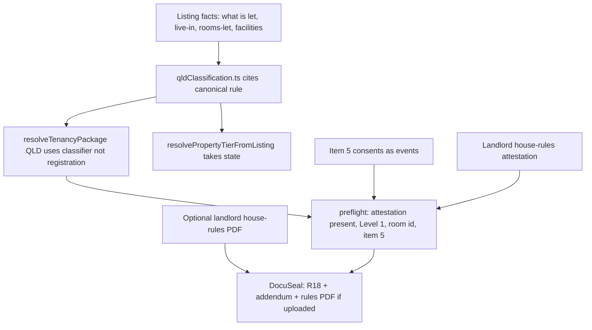

# QLD rooming ungate plan

**Status:** Stage 1 approved to build on the accept-only gate as written. Stages 2 to 6 are not approved. Revised 5 Sep 2026 for Item 5, Item 11, Item 13.2, and optional house-rules attach.
**Canonical rule:** [`docs/legal/qld-classification-rule.md`](legal/qld-classification-rule.md). Do not restate the test here.
**What the router does today:** [`docs/qld-rooming-accommodation-audit.md`](qld-rooming-accommodation-audit.md).
**Contradiction inventory:** [`docs/qld-rule-reconciliation.md`](qld-rule-reconciliation.md).

No product code in this document except Stage 1, which is approved. Preview-or-flag still applies to every user-visible cut. Production only after Rob says go.

---

## Definition of done

Quang Dinh lists a room at Jamboree Heights (QLD, landlord off site, two rooms let individually, shared kitchen and bathrooms, Level 1, no food, no personal care). He accepts an applicant. Both parties sign:

- A filled Form R18 (v15 Sep25 or the then-current RTA form)
- Item 3 (Manager/provider's agent) blank. Never Quni. Quni never signs.
- Item 5 filled from consents each party actually chose, not from a hardcoded email-Yes
- Item 13.2 filled when the landlord knows the last increase date for the room, blank if not previously increased
- Item 17 Yes, driven off a landlord attestation given before signature that he has house rules and has given them to the resident
- House rules appended to the DocuSeal pack when the landlord uploaded them. Optional. Absence of the file does not block Item 17

Nothing wrong is produced. Form R1, R9, R12 and R13 stay with the landlord and the RTA's free forms, the same way Form 1a and Form 9 stay with a QLD general-tenancy landlord today. Quang with a bond lodges it (Form 2 copy we already give) and completes his own R1.

---

## Scoping line

Ungated means nothing wrong is produced, not that everything is built. Anything the landlord needs at signature is in scope. Anything he needs weeks or months later is out, because the RTA publishes those forms free and he uses them directly.

**In at signature:**

- State-aware resolution
- Form inputs the canonical rule needs
- Item 5 notice-consent capture (data). The notice *service* layer stays out
- Item 11: at least two nominated payment methods **and** the direct-credit block (bank, BSB, account name, account number, payment reference). Section 98 and the form are "and", not "or"
- Item 13.2 optional date: last rent increase for the room. Blank means not previously increased. Not a ledger
- Landlord house-rules attestation (Item 17) plus a static downloadable template built from the prescribed schedule
- Optional landlord upload of his adapted house rules, appended to the DocuSeal pack when present
- R18 generator
- DocuSeal package: R18 + rooming Quni addendum + house-rules PDF if uploaded
- Rooming variant of the Quni addendum
- 2-week rent-in-advance cap
- Existing Form 2 / RTA lodgement copy
- Landlord Service Agreement v1.1, in this release or not at all

**Out of this ungate, and stays out:**

- Form R1 generator. Follow-on brief, with R9, R12 and R13.
- R9 / R12 / R13 notice engine and clocks. Item 5 *data* is in. Serving notices, deemed receipt, and withdrawal-as-a-product-flow are not.
- Premises-level house-rules object, versioning, immutable issued versions, display copy, 7-day change notice, objection handling. Follow-on brief. Those are the landlord's obligations, discharged with his own document, and none of them happen before signature.
- A room-level rent-increase **ledger**. Item 13.2 is a single optional date on the listing.
- General-tenancy opt-in election (known path; Quni does not offer it).
- VIC rooming.
- Any national T1/T2/T3 redesign beyond giving `resolvePropertyTierFromListing` `state` and mapping QLD from the classifier.
- RSAA 2002 accreditation.
- Level 2 / Level 3.
- On-campus uni/college product.
- Querying prod for existing QLD off-site room listings or signed 18as. There are none. No QLD tenants have been signed up. No void / re-paper / case-by-case line.

**Do not hang R18 off registration.** QLD routing must not read `is_registered_rooming_house`. The registered-rooming card must not be the QLD trigger. Acceptance test: QLD off-site room with the flag true and with the flag false both classify as rooming. Quang (flag false) is the path that must generate R18.

---

## Locked: T3 as output, never as input

Classifier outcomes for QLD: `general_tenancy` (18a) / `rooming` (R18) / `outside_act` (occupancy). Pricing still uses `t1`/`t2`/`t3` as **outputs** of that mapping. QLD rooming → `t3` so the fee matrix has a row. That is not using the T3 **flag**. NSW keeps today's registration trigger. VIC keeps today's table until its own brief.

Root cause: [`src/lib/pricing/index.ts`](../src/lib/pricing/index.ts) `resolvePropertyTierFromListing(propertyType, isRegisteredRoomingHouse)` has no `state`. Callers that already have state must pass it: [`LandlordPropertyFormPage.tsx`](../src/pages/landlord/LandlordPropertyFormPage.tsx), [`landlordAcceptTierOptions.ts`](../src/lib/landlordAcceptTierOptions.ts), [`Booking.tsx`](../src/pages/Booking.tsx), [`api/lib/booking/serviceTierSnapshot.js`](../api/lib/booking/serviceTierSnapshot.js). Do not add a QLD `if` inside a still-stateless function.

---

## Locked: `property_group_id` is not a legal entity

`property_group_id` groups duplicates for the landlord UI. It is not a legal entity. Independent second listings at the same address can miss the group. Quang's two rooms are exactly that shape.

v1 does not try to share a premises object across them. Each listing carries its own house-rules attestation. The template is a static download. Optional upload, if used, is per listing. Two rooms, two attestations, one landlord.

---

## Architecture (target)

During Stages 1 to 5 the router classifies QLD rooming correctly and returns `supported: false`. Listing save and publish are allowed. Accept is not. Stage 6 registers `qld-form-r18` and accept proceeds.

---

## Item 17 and the addendum, settled on the instrument

**Item 17.** Form R18 standard terms clause 18(2) places the obligation to give the house rules on the **provider**, before entering into the agreement. Item 17 is the provider's statement about whether he discharged his own obligation, on his own form. Quni is not a party and does not sign. Item 17 is truthfully Yes when the landlord attests before signature that he has house rules and has given them to the resident. Nothing in the Act or the form requires Quni to hold or generate that document. Optional upload does not change that key: Item 17 follows the attestation, not the file.

**Addendum.** Form R18 standard terms clauses 2(4) to 2(6): the parties may agree special terms; a duty or entitlement under the Act overrides any term inconsistent with it; a standard term overrides an inconsistent special term. The Quni rooming addendum is subordinate special terms. That is stated on the instrument. The addendum must not tell the parties to use Form 9, Form 1a, or Form 14a. On this path those are R9 and R1, which the landlord downloads from the RTA when he needs them.

**House rules in the pack.** Clause 2(3) makes house rules terms of the agreement. When the landlord uploads his adapted rules, they are appended so the resident signs a pack that contains those terms. When he does not, Item 17 can still be Yes on the attestation. Quni is not the author and not the administrator.

Do not route these points to counsel. Cite the form.

---

## Item 5, settled on the form

Form R18 item 5 is a notice consent matrix: four parties (provider, resident, provider's agent, resident's representative) by three channels (email, text message, facsimile), each with yes/no and its own address.

Clause 36(3)(c) makes electronic service valid only if there is an electronic address in items 1 to 4 **and** item 5 permits that specific channel. Clause 36(5) allows address change only by notice to each other relevant party. Clause 36(7) allows withdrawal of consent only the same way. Clause 36(8) sets deemed receipt per channel, email when it enters the recipient's server.

Capture is in Stage 2. Fill is in Stage 4. The notice service layer stays out of v1.

Do not hardcode it the way Form 18a hardcodes email Yes in [`officialQldForm18aFill.ts`](../api/lib/documents/officialQldForm18aFill.ts). That sets service consents on the landlord's and the resident's behalf that neither chose, and withdrawal later requires formal notice between them.

Store it shaped for the later service layer: per party, per channel, per address, with change and withdrawal as **events** rather than as overwrites. Current consents are a projection. Getting the shape wrong now costs twice.

Item 3 is blank, so the provider's-agent party is empty (no addresses, consents No). Resident's representative is optional and defaults empty. The schema still has all four parties.

Provider consents are collected on the listing. Resident consents are collected on apply. The generator reads the projection. It does not invent Yes.

---

## Four open form decisions (Rob)

Decided that they are open. Not decided what the answers are. Stage 2 starts 4 to 6 days after Stage 1 is approved and does not wait. Cost if the answer lands after Stage 2 has started:

1. **Shared-facilities vs self-contained on the room card.** Likely yes. **QLD listings only.** VIC rooming is occupancy capacity (not less than 4) plus council registration, not shared facilities. NSW turns on exclusive possession and landlord control; an off-site landlord letting a room under a written agreement gets FT6600, the same form a self-contained studio would get. Queensland is the only one of the three where sharing a kitchen or bathroom decides which prescribed form is produced. Do not show the question on NSW or VIC. Do not back-ask live NSW or VIC studio listings.

   If "yes" after Stage 2 has already treated every QLD off-site room as rooming: add the QLD-only field, back-ask live **QLD** room-card studios, restamp QLD classifier tests. About 1 to 2 extra engineer-days, and do not ungate QLD room-card `studio` until it lands. If "no": Stage 2 is already correct; cost is zero. If it lands after ungate as "yes", that is the studio hole: a self-contained unit on the QLD room card can get R18 when the rule says 18a. Entire-place studio card already maps to general tenancy and stays 18a.
2. **Live-in managing agent.** Stage 2 starts on the support-path default. Item 3 stays blank. If Rob later wants it collected: a listing field plus a classifier input (owner off site, agent on site may be the live-in branch). About 3 to 5 extra engineer-days, and it is not on Quang's path. If it stays support-only after Stage 2: cost is zero.
3. **Rooms-let helper wording** ("bedrooms"; silent on whether the provider's own room counts). Live-in s 43 only. Quang is off-site and does not need the count. A late wording fix is copy, not a router change, if Stage 1 already gates on-site 4+ as rooming. Hours, not days. Not on the critical path.
4. **On-campus exclusion.** Lean: do not collect. `campus_id` is not that test. If Rob later wants it: one listing question and one classifier input. About 1 to 2 extra engineer-days. Cost of not collecting: a uni or NFP college inside campus boundaries could theoretically get R18. Quni's marketplace is off-campus. Accept that.

Highest late-land cost is still (1), and only if we ungate QLD room-card studios without it. It is a QLD form-and-classifier add, not an all-states migration.

---

## Stages

### Stage 1. State-aware resolution. Stop issuing 18a at accept, not at listing

**Approved to build.**

**DoD:**

- QLD off-site room and shared bedroom no longer resolve to `qld-form18a`.
- Classifier tests match the canonical table.
- `resolveTenancyPackage` QLD cases match the classifier.
- `resolvePropertyTierFromListing` requires `state`.
- QLD routing does not read `is_registered_rooming_house`. Acceptance test: QLD off-site room with the flag true and with the flag false both classify as rooming.
- QLD rooming maps to `t3` as an output. [`qldServiceTierAvailability`](../api/lib/serviceTier/qld.ts) for that output: **Listing available, Managed unsupported.** That is what lets the Brisbane funnel keep listing. Today's `t3` row ("unsupported because registered rooming") must not remain the save blocker.
- The package is `supported: false` until Stage 6. Generator id is not registered. `confirmListing` already runs preflight **before** the $99 charge; that fail-closed path is the legal gate.
- Entire-place QLD stays 18a and remains acceptable.
- On-site ≤3 stays occupancy and remains acceptable.
- On-site 4+ classifies as rooming, same accept gate, and is not told to use the registered-rooming card.
- Admin `qld-t2` intent no longer means "off-site room = 18a."

**What the landlord sees at the accept gate**

The listing is live. Applicants can apply and sit verified. On booking review, Accept as Quni Listing is visible as the product they listed under, but it is disabled (or a click opens the same copy and does not call confirm). Copy, in substance:

- This arrangement is rooming accommodation under the RTRA Act.
- The prescribed form is Form R18.
- Quni does not generate Form R18 yet. You cannot accept this applicant until that form is available.
- Do not sign a Form 18a for this listing. Quni will not produce one.
- Keep the applicant. You will be able to accept them on this booking when Form R18 ships.

The confirm API still returns `agreement_preflight_failed` with that reason if anything bypasses the button. No charge. No DocuSeal. No 18a.

**Unblocks:** Safe build window without killing the Brisbane listing funnel. Quang cannot be papered with 18a.

**Key files:** [`api/lib/tenancy/qldClassification.ts`](../api/lib/tenancy/qldClassification.ts) (new), [`api/lib/resolveTenancyPackage.ts`](../api/lib/resolveTenancyPackage.ts), [`api/lib/resolveTenancyPackage.test.ts`](../api/lib/resolveTenancyPackage.test.ts), [`src/lib/pricing/index.ts`](../src/lib/pricing/index.ts), [`api/lib/serviceTier/qld.ts`](../api/lib/serviceTier/qld.ts), [`src/lib/landlordAcceptTierOptions.ts`](../src/lib/landlordAcceptTierOptions.ts), [`src/pages/landlord/LandlordBookingReviewPage.tsx`](../src/pages/landlord/LandlordBookingReviewPage.tsx), [`src/lib/tenancy/qldBoarderLodger.ts`](../src/lib/tenancy/qldBoarderLodger.ts), [`src/lib/landlordAccommodationChoice.ts`](../src/lib/landlordAccommodationChoice.ts), [`api/lib/tenancy/jurisdictionCopy.ts`](../api/lib/tenancy/jurisdictionCopy.ts).

**Estimate:** 5 engineer-days. User-visible. Ship on its own. Preview, then Production if Rob says go.

### Stage 2. Form inputs the rule and the signature need

Not approved. Starts four to six days after Stage 1 is approved. Does not wait on the four form decisions.

**DoD:** A QLD rooming listing can persist without the registered card, and the row is complete enough for later preflight:

- Room identity (`room_description` live for QLD, not NSW-T3-only)
- Level 1 locked; Level 2 and Level 3 blocked
- Student-accommodation tick (particulars, not a routing input)
- Shared-facilities question on QLD listings only, and only if decision 1 has landed as yes by then; otherwise treat the QLD room card as shared facilities. NSW and VIC room cards are unchanged.
- Rooms-let helper wording only if decision 3 has landed
- Persons in the room and at the premises
- Utilities without "Form 18a Items 13-15" labels
- Item 11: at least two nominated payment methods **and** the direct-credit block (bank, BSB, account name, account number, payment reference). Not either/or
- Item 13.2: optional date, last rent increase for this room. Blank means not previously increased
- Item 5: event-shaped store (per party, per channel, per address; grant / change / withdraw as events). Provider matrix on the listing. Resident matrix on apply. Agent and representative rows exist and stay empty while Item 3 / Item 4 are blank. Projection is what Stage 4 fills. No 18a-style hardcoded email Yes
- Rent treated as accommodation-only at Level 1

Listing save and publish stay allowed (Stage 1). Accept stays gated until Stage 6.

**Unblocks:** R18 fill. Does not ungate.

**Estimate:** 10 engineer-days. The jump from 6 is Item 5: schema plus listing UI plus apply UI, stored as events. Item 11 "and" and Item 13.2 are small inside that number.

### Stage 3 prerequisite. Read the prescribed house rules schedule

Not approved.

Every version of the prescribed house rules we hold is an RTA fact sheet summary, not the instrument. A summary of a summary is how the four-room half-rule got into the router.

**DoD:** Read Schedule 7 of the Residential Tenancies and Rooming Accommodation Regulation 2025 (SL 2025-89) from the Queensland legislation text, not from an RTA fact sheet. Record the schedule text in the repo (for example `docs/legal/qld-prescribed-house-rules-sch7.md`) as the source the Stage 3 template is built from. This is a reading task, not a legal opinion.

Source of truth to open: [SL 2025-89](https://www.legislation.qld.gov.au/view/html/inforce/current/sl-2025-0089). AustLII mirror of Schedule 7 exists; prefer the legislation site.

**Unblocks:** Stage 3 template. Stage 3 does not start without this file.

**Estimate:** 1 engineer-day.

### Stage 3. Attestation, static template, optional attach

Not approved. This is the whole of Stage 3. There is no 3b.

**DoD:**

- Before signature, the provider attests that he has house rules and has given them to the resident.
- Item 17 is driven off that attestation. Yes only if the attestation is present. The generator refuses to run without it.
- A static house-rules template, built from the Stage 3 prerequisite schedule, covering the prescribed categories. The landlord downloads it and adapts it.
- Optional upload: the landlord may attach his adapted house rules (PDF). When present, Stage 4 appends that file to the DocuSeal pack. When absent, the pack is R18 + addendum only. Item 17 still keys off the attestation, not off the upload.
- Quni does not version the file, does not make a premises object, and does not author or administer the rules. It is a landlord-supplied attachment.

Out of this stage: premises-level object, versioning, immutable issued versions, display copy, 7-day change notice, objection handling.

**Optional attach estimate: 2 engineer-days.** Listing file input, store a path on the property, pass the bytes into the new Stage 4 DocuSeal `documents[]` as a third PDF when present. No extra sign tags. Stage 4 is a new send path, so this does not have to teach the existing Form 18a two-file webhook split a third branch. If it were a bolt-on to [`docuseal.ts`](../api/lib/docuseal.ts) 18a reconcile (agreement vs addendum signed paths), it would blow past two days. It is not that bolt-on. Keep it.

**Unblocks:** Truthful Item 17. Credible Item 17 when the file is attached. Stage 4 preflight.

**Estimate:** 5 engineer-days (3 attestation + template, 2 optional attach).

### Stage 4. Form R18, rooming addendum, signing flow

Not approved.

**DoD:** Generator id `qld-form-r18` on the existing listing pipeline (same shape as [`qldForm18a.ts`](../api/lib/documents/listingTenancyGeneration/qldForm18a.ts) / NSW T3 registry, not NSW T3's legal model). Official AcroForm fill of Form R18, same family as [`officialQldForm18aFill.ts`](../api/lib/documents/officialQldForm18aFill.ts).

Fill:

- Item 3 empty. Quni not a signer
- Item 5 from the consent projection. No hardcoded channel
- Item 11 method 1, method 2, **and** the direct-credit block
- Item 13.2 from the optional date, else blank
- Item 17 Yes only with attestation

New rooming addendum; **do not** reuse [`QuniPlatformAddendumQld.tsx`](../src/lib/documents/QuniPlatformAddendumQld.tsx). Clauses 2(4) to 2(6) are why special terms are allowed and why they lose to the Act and to standard terms.

DocuSeal package: R18 + addendum, plus the landlord house-rules PDF when uploaded. Emails and explainer say rooming accommodation / Form R18, not general tenancy. Sample PDF. Golden tests: Item 3 blank, Item 5 matches stored consents, Item 11 has two methods and the bank block, Item 13.2 blank unless dated, Item 17 Yes only with attestation, no "Form 18a", no Form 9 / 1a / 14a on this path.

The generator exists in this stage. The service matrix still withholds accept until Stage 6, or Stage 6 lands in the same release. Do not publish LSA v1.1 in this stage alone.

**Unblocks:** A signing package that is the right form.

**Estimate:** 12 engineer-days. The jump from 10 is Item 5 fill (many yes/no + address fields on the official PDF) plus wiring the optional third document on the new send path. The field-map / rename pass remains the bulk.

### Stage 5. Form R1. Out of v1

Not on the ungate path. Follow-on brief with R9, R12 and R13.

R18 clause 4 references R1 and clause 24 points at the entry sections the same way Form 18a's standard terms reference the entry condition report. We generate neither 1a nor R1. The landlord downloads the form from the RTA.

v1 still enforces the 2-week rent-in-advance cap at listing/accept, and still gives Form 2 lodgement copy. Those are landlord-facing rules, not documents we generate. Do not copy NSW T3 proprietor-held deposit rules.

### Stage 6. LSA v1.1 and ungate

Not approved.

**DoD:** [`LANDLORD_SERVICE_AGREEMENT_VERSION`](../src/lib/landlordServiceAgreement.ts) bumps to `listing-1.1` in the **same release** as accept becoming possible for QLD rooming. Reaccept modal. Package `supported: true`, generator `qld-form-r18`. Managed stays unsupported. Quang path: list → apply → accept → preflight → sign. Admin probe supported.

LSA v1.1 prose is already drafted with a change log. Rob will hand it over at Stage 6. One clause (2.2, which currently promises a house rules document we prepare) needs to be reworded to match Stage 3's template-and-attestation model, and Rob will do that.

Engineering for Stage 6 is unchanged: version bump, reaccept modal, accept flip.

**Unblocks:** Done.

**Estimate:** 4 engineer-days.

---

## Totals

One engineer, no branches, Stage 3 read overlapping Stage 2:

| Stage | Engineer-days |
|---|---|
| 1 Accept-gate classifier | 5 |
| 2 Listing + apply fields (incl. Item 5 events) | 10 |
| 3 prerequisite (Schedule 7) | 1 |
| 3 Attestation, template, optional attach | 5 |
| 4 R18 + rooming addendum + Item 5 fill | 12 |
| 6 LSA v1.1 + ungate | 4 |
| **Total** | **37 engineer-days** |

**Calendar: 8 weeks** from Stage 1 approval to Quang-done, if Stage 1 ships in week 1 and later stages run serially after it (Stage 3 read during Stage 2).

---

## Single thing most likely to blow the estimate

**The Form R18 AcroForm fill**, now including Item 5's consent matrix on the official PDF. Official PDF, field rename, golden tests, plus a new rooming addendum that must not inherit Form 9 / 1a / 14a from [`QuniPlatformAddendumQld.tsx`](../src/lib/documents/QuniPlatformAddendumQld.tsx). Form 18a already proved that path is a multi-week document job hiding inside "just fill the form." Premises-level house rules is not in this build. Optional attach stays inside two days because it rides a new DocuSeal path, not the 18a two-file split.

---

## Is Stage 1 with accept-only gating genuinely safe?

**Safe against a signed wrong form.** `confirmListing` already calls `preflightListingTenancyDocument` before creating the $99 PaymentIntent. If QLD rooming is `supported: false`, accept cannot charge, cannot write `tenancy_documents`, and cannot send DocuSeal. Disable the button and keep that API fail-closed. Do not leave QLD off-site rooms on `t2` / `qld-form18a` while listings stay live. That is the only mapping that produces 18a today.

**What a live listing still does, and is easy to miss:**

1. **Service matrix must flip with the classifier.** Today's QLD `t3` row is listing-unsupported. If Stage 1 maps rooming → `t3` and leaves that row alone, save still dies and the funnel still dies. Stage 1 has to make QLD `t3` Listing available **and** keep the package unsupported. Those are two different knobs.
2. **Apply and bond copy.** [`Booking.tsx`](../src/pages/Booking.tsx) already returns null regulatory bond copy when the package is unsupported. Applicants can still apply. They will not see the RTA lodgement paragraph unless we write a rooming-shaped holding line. That is not a wrong agreement. It is a quieter apply than T2.
3. **Surfaces that still say "tenancy" / Form 18a** for an off-site room (listing cards, `bondPublicCopy`, utilities labels, sample-agreements page, AI matching). A live listing makes those sentences visible to Brisbane applicants. Stage 1 should at least stop claiming Form 18a on that card. It does not need to rewrite the FAQ corpus.
4. **Applicants accumulate.** Verified people wait on bookings the landlord cannot accept. That is the point of keeping the funnel. Tell the landlord at accept, and tell the applicant something true at apply ("the provider cannot sign until Quni issues Form R18") or they will message Quang as if move-in is next week.
5. **No other generate path.** Confirm, regenerate, and any admin "send agreement" must all go through `resolveTenancyPackage`. There is no second 18a writer keyed only on `state === 'QLD'`.

Accept-only gating is safe if Stage 1 actually breaks the 18a mapping. It is not safe if we only hide a button and leave `private_room_landlord_off_site` + QLD on `qld-form18a`. Live listings are fine. Live 18a routing is not.

---

## Explicitly not this plan

Stage 1 is approved to build. Nothing else is. No R18 generator, no Item 5 schema, no LSA publish, until a later brief says to build a named stage.
