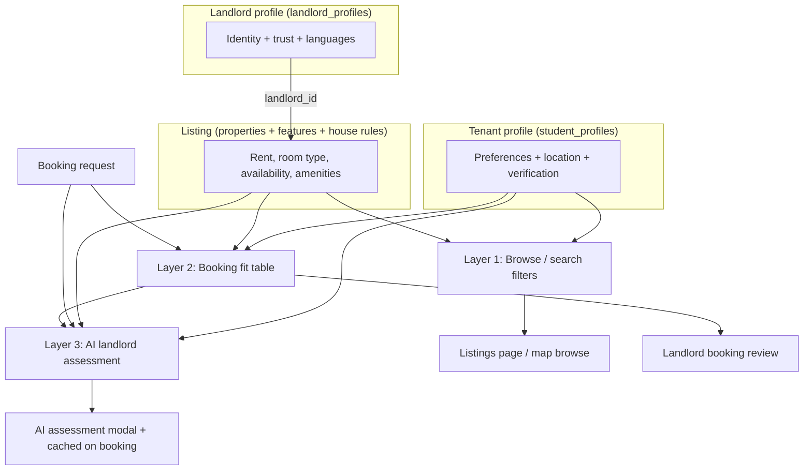

# Tenant–Landlord Matching Data Reference

**Last updated:** 2026-06-05  
**Scope:** All data the Quni Living platform stores that can be used to match tenants (students and professional renters) with landlords and their listings.

This document covers:

1. **Three data domains** - tenant profile, landlord profile, and listing/property data (plus booking-level refinements).
2. **Three matching layers** - browse/search filters, booking fit table, and AI landlord assessment.
3. **Cross-reference matrices** - which tenant fields map to which listing/landlord fields, and whether matching is automated today.

---

## Table of contents

1. [Architecture overview](#1-architecture-overview)
2. [Matching layer 1: Browse and search filters](#2-matching-layer-1-browse-and-search-filters)
3. [Matching layer 2: Booking fit table](#3-matching-layer-2-booking-fit-table)
4. [Matching layer 3: AI landlord assessment](#4-matching-layer-3-ai-landlord-assessment)
5. [Domain A: Tenant / renter data](#5-domain-a-tenant--renter-data)
6. [Domain B: Landlord data](#6-domain-b-landlord-data)
7. [Domain C: Listing and property data](#7-domain-c-listing-and-property-data)
8. [Booking-level matching data](#8-booking-level-matching-data)
9. [Reference and lookup tables](#9-reference-and-lookup-tables)
10. [Full cross-reference matrix](#10-full-cross-reference-matrix)
11. [Protected characteristics and non-discrimination](#11-protected-characteristics-and-non-discrimination)
12. [Gaps and future opportunities](#12-gaps-and-future-opportunities)
13. [Source files](#13-source-files)

---

## 1. Architecture overview

Quni Living does **not** currently run a single automated “match score” across the platform. Matching happens in three distinct layers, each with different inputs and consumers.



**Key principle:** Landlords are matched **indirectly** through their listings (`properties.landlord_id`). There is no standalone “landlord ↔ tenant” pairing algorithm; the listing is the bridge.

---

## 2. Matching layer 1: Browse and search filters

**Purpose:** Let tenants discover listings that meet their search criteria.  
**Implementation:** `src/lib/fetchListingsBrowse.ts`, `src/hooks/useListingsQuery.ts`, `src/pages/Listings.tsx`  
**Consumer:** Public listings browse (students and professional renters).

### Active filters

| Filter | Query param / state | Database fields | Logic |
|--------|---------------------|-----------------|-------|
| Text search | `q` | `properties.title`, `suburb`, `address` | Case-insensitive `ilike` OR |
| University | `university` | `properties.university_id` | Exact match (students only; hidden for professional renters) |
| Campus | `campus` | `properties.campus_id` | Exact match; takes precedence over university |
| Suburb | `suburb` | `properties.suburb` | Case-insensitive `ilike` |
| Room type | `roomType` | `properties.room_type` | Exact match: `single`, `shared`, `studio`, `apartment`, `house` |
| Price bucket | `priceFilter` | `properties.rent_per_week` | Range: `$0–200`, `$200–300`, `$300–400`, `$400+` |
| Furnished | `furnished` | `properties.furnished` | `true` only when filter active |
| Move-in date | `moveIn` | `available_from`, `available_to` + lease RPC | Date-aware availability window |
| Move-out date | `moveOut` | Same + `property_lease_availability` RPC | Excludes properties unavailable for selected range |
| Near-point search | `near_lat`, `near_lon`, `near_radius` | `latitude`, `longitude` | `properties_near_point` RPC; radius 5–25 km (default 15) |
| Sort | `sort` | Various | `distance`, `rent_asc`, `rent_desc`, `newest` |

### Near-point anchor sources

| Persona | Anchor | Tenant fields used |
|---------|--------|-------------------|
| Student | Selected campus or custom map point | `campus_id` → campus lat/lon; or manual coordinates |
| Professional renter | Workplace | `workplace_latitude`, `workplace_longitude` from `student_profiles` |

**Note:** Distances are approximate straight-line km, not driving time (`STRAIGHT_LINE_DISTANCE_NOTE`).

### What browse does *not* filter on (today)

- Tenant `budget_min_per_week` / `budget_max_per_week` (not auto-applied; user picks price bucket manually)
- `room_type_preference` from profile (not auto-applied)
- Pets, parking, bills, occupancy, lease length
- Verification tier
- Landlord `languages_spoken`
- Listing features or house rules

---

## 3. Matching layer 2: Booking fit table

**Purpose:** Give landlords a structured match/mismatch view when reviewing a booking request.  
**Implementation:** `src/lib/bookingFitSummary.ts` (UI), `api/lib/bookingFitForAssessment.ts` (API duplicate - keep in sync)  
**Consumer:** Landlord booking review page, AI assessment prompt.

### Fit row statuses

| Status | Meaning |
|--------|---------|
| `match` | Tenant request aligns with listing data |
| `mismatch` | Clear conflict between tenant and listing |
| `unknown` | Missing data on one or both sides; landlord should confirm |

### The seven fit dimensions

#### 1. Move-in date

| Side | Fields |
|------|--------|
| Tenant / booking | `bookings.move_in_date` or `start_date`; `student_profiles.move_in_flexibility` (`exact`, `one_week`, `two_weeks`) |
| Listing | `properties.available_from` |

**Logic:** Match if requested date ≥ available-from. With flexibility `one_week` or `two_weeks`, allow up to 7 or 14 days before available-from.

#### 2. Lease length

| Side | Fields |
|------|--------|
| Tenant / booking | `bookings.lease_length`; profile `preferred_lease_length` |
| Listing | `properties.lease_length` |

**Logic:** Normalised string compare. Either side containing `flexible` → `unknown`. Values: `3_months`, `6_months`, `12_months`, `flexible`.

#### 3. Occupancy

| Side | Fields |
|------|--------|
| Tenant | `student_profiles.occupancy_type` (`sole`, `couple`, `open`); `bookings.occupant_count` (1 or 2) |
| Listing | `properties.max_occupants`, `room_type`, `property_type` |

**Logic:**

- `occupant_count === 2` → requires `max_occupants >= 2`
- `occupancy_type === 'couple'` → `max_occupants >= 2`, or `shared` room type, or `private_room_landlord_on_site`
- `occupancy_type === 'sole'` → mismatch if `room_type === 'shared'`
- `occupancy_type === 'open'` → always match

#### 4. Pets

| Side | Fields |
|------|--------|
| Tenant | `student_profiles.has_pets` |
| Listing | Feature names matching pet/cat/dog patterns via `property_features` |

**Logic:** If tenant has pets and no pet-friendly feature signal → mismatch. No pets → match regardless.

#### 5. Parking

| Side | Fields |
|------|--------|
| Tenant | `student_profiles.needs_parking`; `bookings.parking_selected` |
| Listing | `properties.parking_available`; feature names matching parking/garage patterns |

**Logic:** `parking_selected === true` at booking takes precedence. Mismatch if parking needed/selected but listing has no parking signal.

#### 6. Bills

| Side | Fields |
|------|--------|
| Tenant | `student_profiles.bills_preference` (`included`, `separate`, `either`) |
| Listing | Feature names matching “bills included” / “utilities” via `property_features` |

**Logic:** `either` → match. `included` requires bills-included signal. `separate` requires no bills-included signal.

#### 7. Furnishing

| Side | Fields |
|------|--------|
| Tenant | `student_profiles.furnishing_preference` (`furnished`, `unfurnished`, `either`) |
| Listing | `properties.furnished` |

**Logic:** `either` → match. Otherwise compare boolean furnished flag.

---

## 4. Matching layer 3: AI landlord assessment

**Purpose:** Generate a short narrative assessment for landlords reviewing an applicant.  
**Implementation:** `api/ai/student-assessment.ts` (Vercel Edge, Anthropic Claude)  
**Consumer:** Landlord dashboard modal; cached on `bookings.ai_assessment` when `bookingId` provided.

### Inputs fed to the model

**From tenant profile:**

- Verification tier (`verification_type`: student / identity / none)
- Accommodation route (`accommodation_verification_route`: student / non_student)
- Name, university, campus, course, year of study, student type
- Verification steps: uni email, work email, ID, enrolment, identity supporting doc
- Room type preference, budget range, smoker status
- Occupancy, move-in flexibility, pets, parking, bills, furnishing preferences
- Guarantor presence and name (if provided)

**From listing / booking context (when `bookingId` present):**

- Property title, rent, room type, suburb, university/campus links
- Listing fit summary block (same seven dimensions as Layer 2)
- Booking move-in, lease length, occupant count, parking selection, weekly rent

### Model rules (matching-relevant)

- Must reflect fit summary faithfully: any `MISMATCH` is a material gap
- Must not invent rent amounts, commute claims, or campus proximity unless in listing context
- Must not reference nationality, gender, or protected characteristics
- Budget fit is commented on when rent appears in context
- Smoking status is considered against listing context

### What AI does *not* do

- Does not produce a numeric score
- Does not auto-accept or reject bookings
- Does not run at browse time (only on landlord review)

---

## 5. Domain A: Tenant / renter data

**Table:** `public.student_profiles`  
**Type definition:** `src/lib/database.types.ts`  
**Captured via:** Student onboarding (`src/pages/onboarding/StudentOnboarding.tsx`), student profile (`src/pages/StudentProfile.tsx`)

### 5.1 Identity and contact

| Field | Type | Values / notes | Matching role |
|-------|------|----------------|---------------|
| `id` | uuid | Primary key | Booking FK |
| `user_id` | uuid | Auth user | - |
| `first_name`, `last_name`, `full_name` | text | - | Display / AI |
| `email`, `phone` | text | - | Contact only |
| `date_of_birth` | date | - | Age/eligibility (not auto-matched) |
| `avatar_url` | text | - | Display only |
| `bio` | text | Free text | AI context only |

### 5.2 Demographics (stored, restricted use)

| Field | Type | Values | Matching role |
|-------|------|--------|---------------|
| `gender` | text | `male`, `female`, `non_binary`, `prefer_not_say` | **Not used for matching** |
| `nationality` | text | e.g. Chinese, Indian, Australian, Other | **Not used for matching** |

### 5.3 Academic profile (student route)

| Field | Type | Values | Matching role |
|-------|------|--------|---------------|
| `university_id` | uuid FK | → `universities` | Location / campus proximity |
| `campus_id` | uuid FK | → `campuses` | Campus proximity |
| `course` | text | Free text | AI assessment |
| `year_of_study` | integer | 1–5+ | AI assessment |
| `study_level` | text | `year_1` … `year_4`, `postgraduate`, `phd` | AI assessment |
| `student_type` | text | `domestic`, `international` | AI assessment |
| `uni_email` | text | - | Verification |
| `uni_email_verified` | boolean | - | Trust signal |
| `enrolment_doc_url` | text | - | Verification |
| `accommodation_verification_route` | text | `student`, `non_student` | vs `open_to_non_students` |

### 5.4 Professional renter / workplace

| Field | Type | Matching role |
|-------|------|---------------|
| `work_email`, `work_email_verified` | text / boolean | Verification (non-student path) |
| `workplace_label` | text | Display |
| `workplace_address`, `workplace_suburb`, `workplace_state`, `workplace_postcode` | text | Geocoding input |
| `workplace_latitude`, `workplace_longitude` | numeric | Near-work browse anchor |
| `workplace_geocoded_at` | timestamptz | Metadata |

### 5.5 Housing preferences (primary matching signals)

| Field | Type | Allowed values | Primary listing match |
|-------|------|----------------|----------------------|
| `room_type_preference` | text | `single`, `shared`, `studio`, `apartment`, `house` | `properties.room_type` |
| `budget_min_per_week` | numeric | Derived from budget range | `properties.rent_per_week` |
| `budget_max_per_week` | numeric | Derived from budget range | `properties.rent_per_week` |
| `preferred_move_in_date` | date | - | `properties.available_from` |
| `preferred_lease_length` | text | `3_months`, `6_months`, `12_months`, `flexible` | `properties.lease_length` |
| `occupancy_type` | text | `sole`, `couple`, `open` | `max_occupants`, `room_type`, `property_type` |
| `move_in_flexibility` | text | `exact`, `one_week`, `two_weeks` | Move-in fit slack |
| `furnishing_preference` | text | `furnished`, `unfurnished`, `either` | `properties.furnished` |
| `bills_preference` | text | `included`, `separate`, `either` | Bills feature signal |
| `has_pets` | boolean | - | Pet-friendly feature / house rules |
| `needs_parking` | boolean | - | `parking_available`, parking features |
| `is_smoker` | boolean | - | “No smoking” house rule (not automated) |

**Budget ranges** (`src/lib/studentOnboarding.ts`):

| Value | Label | Min | Max |
|-------|-------|-----|-----|
| `under_200` | Under $200 | 0 | 199.99 |
| `200_300` | $200–$300 | 200 | 300 |
| `300_400` | $300–$400 | 300 | 400 |
| `400_500` | $400–$500 | 400 | 500 |
| `500_plus` | $500+ | 500 | 5000 |

### 5.6 Languages and lifestyle

| Field | Type | Values | Matching role |
|-------|------|--------|---------------|
| `languages_spoken` | text[] | See `SPOKEN_LANGUAGE_OPTIONS` in `src/lib/languagesSpoken.ts` (33 languages) | Soft match with landlord; **not automated** |

### 5.7 Verification and trust

| Field | Type | Values | Matching role |
|-------|------|--------|---------------|
| `verification_type` | text | `student`, `identity`, `none` | Eligibility / AI tier label |
| `id_document_url`, `id_submitted_at` | text / timestamptz | - | Trust |
| `identity_supporting_doc_url` | text | - | Non-student verification |
| `has_guarantor` | boolean | - | AI signal |
| `guarantor_name` | text | - | AI signal |
| `onboarding_complete` | boolean | - | Gate to book |
| `terms_accepted_at` | timestamptz | - | Legal |

### 5.8 Emergency contact

| Field | Type | Matching role |
|-------|------|---------------|
| `emergency_contact_name` | text | Lease docs / display |
| `emergency_contact_relationship` | text | - |
| `emergency_contact_phone` | text | - |
| `emergency_contact_email` | text | - |

---

## 6. Domain B: Landlord data

**Table:** `public.landlord_profiles`  
**Linked to listings via:** `properties.landlord_id`

### 6.1 Identity and business

| Field | Type | Values | Matching role |
|-------|------|--------|---------------|
| `id` | uuid | - | Listing FK |
| `user_id` | uuid | Auth user | - |
| `first_name`, `last_name`, `full_name` | text | - | Display / AI |
| `company_name` | text | - | Company/trust landlords |
| `abn` | text | - | Compliance |
| `landlord_type` | text | `individual`, `company`, `trust`, `other` | Operational |
| `email`, `phone` | text | - | Contact |
| `bio` | text | - | Profile display |
| `avatar_url` | text | - | Display |

### 6.2 Location

| Field | Type | Matching role |
|-------|------|---------------|
| `address`, `suburb`, `state`, `postcode` | text | Landlord residence; homestay / on-site context |
| `residence_location` | text | Overseas/non-NSW residence (FT6600 compliance) |

### 6.3 Trust and platform status

| Field | Type | Matching role |
|-------|------|---------------|
| `verified` | boolean | Stripe-synced verification badge |
| `admin_override_verified` | boolean | Admin trust override |
| `stripe_connect_*` | various | Payments eligibility |
| `has_landlord_insurance` | boolean | Eligibility signal |
| `onboarding_complete` | boolean | Gate to list |
| `non_discrimination_policy_accepted_at` | timestamptz | Policy compliance |
| `terms_accepted_at`, `landlord_terms_accepted_at` | timestamptz | Legal |
| `fee_exempt` | boolean | Platform fees |

### 6.4 Languages

| Field | Type | Matching role |
|-------|------|---------------|
| `languages_spoken` | text[] | Same 33-language set as tenants; shown on listing cards; **not auto-matched** |

### 6.5 How landlord data participates in matching

Landlord fields do not participate in browse filters or the booking fit table directly. They surface as:

- **Trust signals** on listing cards (`verified`, `languages_spoken`)
- **AI assessment** context (landlord first name in prompt)
- **Indirect influence** through listing attributes the landlord configured

---

## 7. Domain C: Listing and property data

**Table:** `public.properties`  
**Related junction tables:** `property_features`, `property_house_rules`

### 7.1 Core listing attributes

| Field | Type | Values | Tenant match |
|-------|------|--------|--------------|
| `title`, `slug`, `description` | text | - | Text search |
| `rent_per_week` | numeric | AUD/week | Budget |
| `bond` | numeric | - | Indirect budget |
| `room_type` | text | `single`, `shared`, `studio`, `apartment`, `house` | `room_type_preference` |
| `property_type` | text | See §7.2 | Occupancy fit |
| `listing_type` | text | `rent`, `homestay`, `student_house` (legacy) | Category |
| `bedrooms`, `bathrooms` | integer | - | Capacity context |
| `rooms_rented_to_residents` | integer | - | Shared-house / rooming-house context |
| `furnished` | boolean | - | `furnishing_preference` |
| `lease_length` | text | `3_months`, `6_months`, `12_months`, `flexible` | Lease fit |
| `available_from`, `available_to` | date | - | Move-in / availability |
| `status` | text | `active`, `inactive`, `pending`, `suspended`, `draft` | Browse gate (`active` only) |
| `featured` | boolean | - | Sort order |
| `images` | text[] | - | Display |
| `open_to_non_students` | boolean | - | Non-student route |

### 7.2 Property type (arrangement)

| Value | Label | Matching notes |
|-------|-------|----------------|
| `entire_property` | Entire property - landlord off site | Suitable for sole/couple |
| `private_room_landlord_off_site` | Private room, landlord elsewhere | Standard room rental |
| `private_room_landlord_on_site` | Private room, landlord on site (boarder/lodger) | Couple fit exception; different bond rules |
| `shared_room` | Shared bedroom | Conflicts with `occupancy_type === 'sole'` |

### 7.3 Location

| Field | Type | Tenant match |
|-------|------|--------------|
| `address`, `suburb`, `state`, `postcode` | text | Suburb/text search |
| `latitude`, `longitude` | numeric | Near-point distance |
| `university_id` | uuid FK | Student university filter |
| `campus_id` | uuid FK | Campus filter / proximity |
| `distance_to_campus_km` | numeric (computed/view) | AI chat context |

### 7.4 Occupancy and pricing modifiers

| Field | Type | Tenant match |
|-------|------|--------------|
| `max_occupants` | integer (1–10, default 1) | Sole vs couple |
| `couple_surcharge_per_week` | numeric | Budget (total rent) |
| `parking_available` | boolean | Parking fit |
| `parking_surcharge_per_week` | numeric | Budget (total rent) |

### 7.5 Homestay / managed services

| Field | Type | Matching role |
|-------|------|---------------|
| `linen_supplied` | boolean | Service expectation; **not auto-matched** |
| `weekly_cleaning_service` | boolean | Service expectation; **not auto-matched** |
| `service_tier` | text | `listing`, `managed` | Platform model |

### 7.6 Features (`property_features` → `features`)

Canonical seeded features (`supabase/quni_supabase_schema.sql`):

| Feature | Matching relevance |
|---------|-------------------|
| WiFi | Amenity (browse: not filtered) |
| Air conditioning | Amenity |
| Heating | Amenity |
| Washing machine | Amenity |
| Dryer | Amenity |
| Dishwasher | Amenity |
| **Parking** | Parking fit signal |
| Gym access | Amenity |
| Swimming pool | Amenity |
| Balcony | Amenity |
| Garden | Amenity |
| **Pet friendly** | Pets fit signal |
| **Bills included** | Bills fit signal |
| Study desk | Student amenity |
| Near public transport | Commute context |

Feature inference helpers: `src/lib/propertyFeatureSignals.ts`

### 7.7 House rules (`property_house_rules` → `house_rules_ref`)

| Rule | `permitted` values | Matching relevance |
|------|-------------------|-------------------|
| No smoking | `yes`, `no`, `approval` | vs `is_smoker` - **not automated** |
| Pets | `yes`, `no`, `approval` | vs `has_pets` - partial (features used instead) |
| Overnight guests | `yes`, `no`, `approval` | Not matched |
| Parties/events | `yes`, `no`, `approval` | Not matched |
| Quiet hours | `yes`, `no`, `approval` | Not matched |
| Parking | `yes`, `no`, `approval` | Supplementary to `parking_available` |

`properties.house_rules` (free text) is a separate narrative field from the structured junction table.

### 7.8 Compliance and legal (eligibility, not preference fit)

| Field | Purpose |
|-------|---------|
| `is_registered_rooming_house` | Tenancy package / bond rules |
| `rooming_house_registration_number` | Compliance |
| `smoke_alarm_*` fields | NSW FT6600 schedule |
| `water_usage_charged_separately` | Bills context |
| `electricity_embedded_network`, `gas_embedded_network` | Utilities disclosure |
| `strata_bylaws_applicable`, `strata_oc_responsible_for_alarms` | Strata context |

### 7.9 Landlord embed on listing browse

Listing cards include a subset of landlord profile:

```text
landlord_profiles ( id, full_name, avatar_url, verified, languages_spoken )
```

---

## 8. Booking-level matching data

**Table:** `public.bookings`

When a tenant submits a booking request, these fields **override or refine** profile-level matching:

| Field | Type | Matching role |
|-------|------|---------------|
| `property_id` | uuid | Links to listing |
| `student_id` | uuid | Links to tenant profile |
| `landlord_id` | uuid | Links to landlord |
| `move_in_date` | date | Move-in fit (preferred over profile date) |
| `start_date`, `end_date` | date | Tenancy term |
| `lease_length` | text | Lease fit |
| `occupant_count` | integer (1–2) | Occupancy fit |
| `parking_selected` | boolean | Parking fit (takes precedence) |
| `weekly_rent` | numeric | Budget fit in AI assessment |
| `co_tenant` | json | Co-applicant details |
| `housemates_count` | integer | Shared-house context |
| `student_message` | text | Intent / AI context |
| `property_type` | text | Snapshot at booking time |
| `service_tier_at_request` | text | `listing` / `managed` |
| `ai_assessment` | text | Cached Layer 3 output |
| `status` | enum | Workflow state (not preference fit) |

---

## 9. Reference and lookup tables

### 9.1 Universities (`universities`)

| Field | Use in matching |
|-------|-----------------|
| `id`, `name`, `slug` | Browse filter, listing association |
| `short_name` | Display |
| `city`, `state` | Geographic context |

Seeded: USYD, UNSW, UTS, Macquarie, WSU (Sydney).

### 9.2 Campuses (`campuses`)

| Field | Use in matching |
|-------|-----------------|
| `id`, `name`, `slug` | Browse filter |
| `university_id` | Parent university |
| `address`, `suburb`, `state` | Location |
| `latitude`, `longitude` | Near-campus search anchor |

### 9.3 Features (`features`)

Canonical amenity labels; linked via `property_features`.

### 9.4 House rules reference (`house_rules_ref`)

Canonical rule labels with icons; linked via `property_house_rules` with `permitted` flag.

---

## 10. Full cross-reference matrix

| Tenant field | Listing / landlord field | Layer 1 browse | Layer 2 fit | Layer 3 AI | Notes |
|--------------|--------------------------|:--------------:|:-----------:|:----------:|-------|
| `budget_min/max_per_week` | `rent_per_week` + surcharges | Manual bucket only | - | Yes | Not auto-filtered from profile |
| `room_type_preference` | `room_type` | If user selects filter | - | Yes | Profile not auto-applied |
| `preferred_move_in_date` | `available_from` | Date filter | Yes | Yes | Booking date overrides |
| `preferred_lease_length` | `lease_length` | - | Yes | Yes | Booking lease overrides |
| `occupancy_type` | `max_occupants`, `room_type`, `property_type` | - | Yes | Yes | Booking `occupant_count` overrides |
| `move_in_flexibility` | `available_from` | - | Yes | Yes | Slack days logic |
| `furnishing_preference` | `furnished` | Furnished filter | Yes | Yes | |
| `bills_preference` | bills feature signal | - | Yes | Yes | |
| `has_pets` | pet feature / house rules | - | Yes | Yes | Features used, not house rules junction |
| `needs_parking` | `parking_available`, parking features | - | Yes | Yes | `parking_selected` overrides |
| `is_smoker` | “No smoking” house rule | - | - | Yes | Not in fit table |
| `university_id` | `university_id` | Yes | - | Yes | AI: fact only, no invented mismatch |
| `campus_id` | `campus_id` | Yes | - | Yes | |
| `workplace_lat/lon` | `latitude/longitude` | Yes (near work) | - | - | Professional renters |
| `accommodation_verification_route` | `open_to_non_students` | - | - | Yes | Eligibility |
| `languages_spoken` | landlord `languages_spoken` | - | - | - | Display only |
| `verification_type` | - | - | - | Yes | Trust tier |
| `course`, `study_level`, `student_type` | - | - | - | Yes | Context only |
| `gender`, `nationality` | - | - | - | **Excluded** | Protected |
| `has_guarantor` | - | - | - | Yes | Signal only |
| `linen_supplied` expectation | `linen_supplied` | - | - | - | Not wired |
| `weekly_cleaning` expectation | `weekly_cleaning_service` | - | - | - | Not wired |
| Landlord `verified` | - | Display on card | - | - | Trust badge |
| Listing features (general) | - | - | Partial | - | Only bills/pets/parking inferred |
| House rules (structured) | - | - | - | - | Not in fit table |

---

## 11. Protected characteristics and non-discrimination

The platform stores some demographic fields (`gender`, `nationality`, `date_of_birth`) for profile completeness and legal documents, but they must **not** drive automated matching or AI recommendations.

For the **full criteria inventory** (every stored field marked as Use / Exclude / Facts only / Not matching / Not wired), see **[ai-matching-criteria-policy.md](./ai-matching-criteria-policy.md)**. That document lists all possible criteria first, then works back to exclusions.

**Excluded from matching (❌):** `gender`, `nationality`, `date_of_birth`, `student_type` (domestic/international - national-origin proxy), plus all protected attributes in the Non-Discrimination Policy that are not stored and must not be inferred.

**Enforced in AI assessment** (`api/ai/student-assessment.ts` system prompt):

- Do not reference nationality, gender, or protected characteristics
- Do not recommend rejection based on protected characteristics
- Landlords must accept the non-discrimination policy (`non_discrimination_policy_accepted_at` on landlord profiles)

**Safe matching dimensions** are limited to housing preferences, logistics (dates, location, budget), occupancy needs, and verification/trust signals.

---

## 12. Gaps and future opportunities

### Stored but not auto-matched

| Data | Opportunity |
|------|-------------|
| Profile budget → browse | “Show listings in my budget” default filter |
| `room_type_preference` → browse | Pre-fill room type filter from profile |
| `languages_spoken` overlap | Soft score or filter for homestay |
| House rules junction | Smoking fit in Layer 2 |
| `linen_supplied` / `weekly_cleaning_service` | Homestay preference fields on tenant profile |
| General amenities (WiFi, AC, etc.) | Feature-based browse filters |
| `distance_to_campus_km` | Sort/filter by max commute distance |
| Saved searches / favourites | No table exists today |
| Numeric match score | Would need weighting model + non-discrimination review |

### Possible “recommended for you” inputs

If building a recommendation engine, the highest-signal fields already collected are:

1. Budget vs `rent_per_week` (+ surcharges)
2. `room_type_preference` vs `room_type`
3. Campus/work proximity (geo)
4. Move-in window vs availability
5. The seven Layer 2 fit dimensions
6. `open_to_non_students` vs accommodation route
7. Verification completeness as eligibility gate (not preference)

---

## 13. Source files

| Area | Path |
|------|------|
| Database types | `src/lib/database.types.ts` |
| Schema reference | `supabase/quni_supabase_schema.sql` |
| Browse filters | `src/lib/fetchListingsBrowse.ts`, `src/lib/listingsBrowseTypes.ts` |
| Listings UI | `src/pages/Listings.tsx`, `src/hooks/useListingsFilters.ts` |
| Booking fit (UI) | `src/lib/bookingFitSummary.ts` |
| Booking fit (API) | `api/lib/bookingFitForAssessment.ts` |
| Feature signals | `src/lib/propertyFeatureSignals.ts` |
| AI assessment | `api/ai/student-assessment.ts` |
| Student onboarding options | `src/lib/studentOnboarding.ts`, `src/lib/studentOccupancyOptions.ts` |
| Workplace search | `src/lib/workplaceLocation.ts`, `docs/professional-workplace-search-scope.md` |
| Languages | `src/lib/languagesSpoken.ts` |
| Property types | `src/lib/listings.ts` |
| Landlord booking review | `src/hooks/useLandlordBookingReview.ts`, `src/pages/landlord/LandlordBookingReviewPage.tsx` |
| House rules migration | `supabase/migrations/20260415130000_house_rules_system.sql` |

---

*This document describes the platform as of the migrations through `20260605170000_non_discrimination_policy.sql`. Regenerate `database.types.ts` after schema changes and update this doc if matching logic or fields change.*
